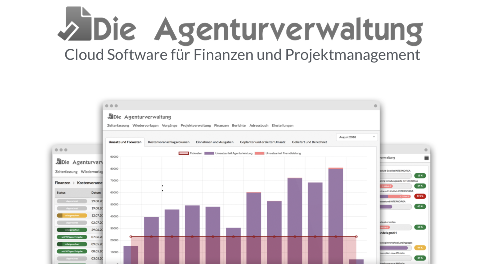

# Über dieses Handbuch

## Gliederung

Du findest zu jedem Menüeintrag in der Agenturverwaltung ein entsprechendes Kapitel in dieses Handbuch.

## Suche

Oben rechts findest du ein Suchfeld mit dem du nach einem Begriff z.B. "Kostenvoranschlag" suchen kannst.

## Neu hier?

Wenn du ein neuer Nutzer bist, lies dir zunächst die ersten Schritte durch:







## Daten in den Abbildungen und Beispielen

Alles Daten in Abbildungen und Beispielen sind frei erfunden. Wir verweisen in manchen Fällen auf die fiktive, von uns erfundene Agentur "Hase Kommunikation". Diese Agentur existiert nicht, ebensowenig die in Beispielen verwendeten Nutzer, ihre Telefonnummern und E-Mail-Adressen.

## Feststehende Begriffe

Wir schreiben bestimmte Wörter gross, wenn sie feststehende Begrifffe repräsentieren.  
Zum Beispiel:  
Die Agenturverwaltung  
Geplante Budgets  
Benutzerdefinierte Berichte  
Benutzerdefinierte Filter

