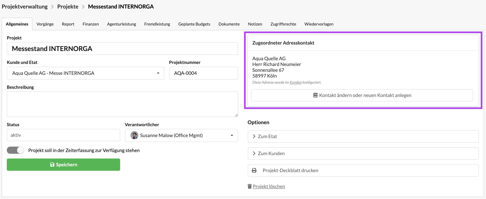
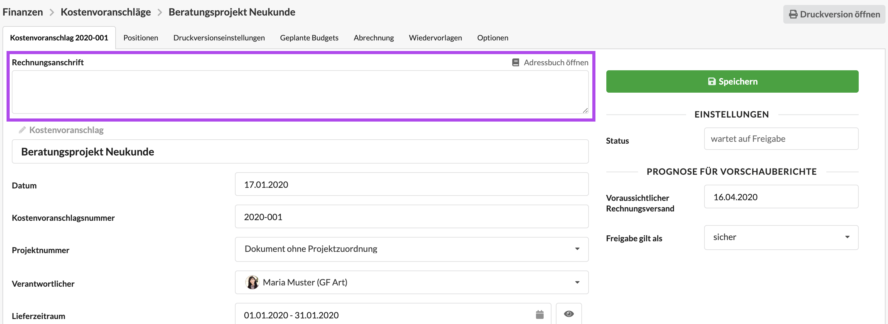

# Kontakte verwenden

Auf dieser Seite erfahrt ihr, wie ihr Organisationen und Personen in der Projektverwaltung und Finanzdokumenten verwendet.

## Verwendung in der Projektverwaltung

Auf allen Hierarchie-Ebenen der Projektverwaltung \(Kunde, Etat und Projekt\) kann auf der Projekt-Stammdatenseite ein "Zugeordneter Adresskontakt" hinterlegt werden.

Nach Klick auf den Button "Kontakt ändern oder neuen Kontakt anlegen" kann über die Suche oder ein Formular zum Anlegen eines Kontakts ein Adresskontakt verknüpft werden.   
Folgende Adresskontakte können verknüpft werden:

* eine Organisation 
* eine Organisation mit einer Person als Ansprechpartner innerhalb der Organisation
* eine Person als Privatpersonen & Einzelunternehmer


**Tipp**  
Zugeordnete Adresskontakte werden weitervererbt, können aber überschrieben werden. Das heißt, dass ein am Kunde hinterlegter Kontakt automatisch bei allen Etats und Projekten dieses Kunden hinterlegt wird. Dies lässt sich aber jederzeit auf der Stammdatenseite eines Etats oder Projekts anpassen.


## Verwendung bei Finanzdokumenten

Bei der Erstellung eines Kostenvoranschlags wird üblicherweise eine postalische Kontaktadresse angeben, ob diese auf dem Kostenvoranschlag als Empfängeradresse darzustellen. 

Wird eine KVA unabhängig von einem Kunden, Etat oder Projekt erstellt, kann das System dem KVA keine Empfängeradresse zuordnen. 

In diesem Fall sollte die Anschrift manuell eingetragen oder über die Funktion "Adressbuch öffnen" ein Adresskontakt gesucht werden.  
Folgende Adresskontakte können verknüpft werden:

* eine Organisation 
* eine Organisation mit einer Person als Ansprechpartner innerhalb der Organisation
* eine Person als Privatpersonen & Einzelunternehmer


**Tipp**  
In den meisten Fällen müssen die Adressdaten nicht manuell eingetragen oder über die Suche zugeordnet werden, weil das System das Finanzdokument einem Adresskontakt zuordnen kann wenn das Dokument mit einem Projekt verknüpft ist und die Adresse die mit dem Kunden des Projekt verknüpft wurde, beim Anlegen des Finanzdokuments automatisch vorgeschlagen wird.


