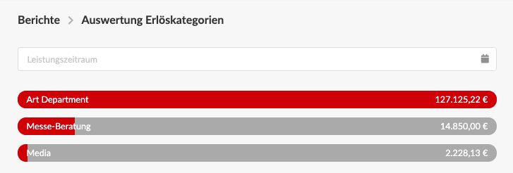

# Auswertung Erlöskategorien

Diese Statistik erlaubt die Auswertung von Erlösen nach Kategorien, sofern diese in Ausgangsrechnungen verwendet wurden.  
In unserem Beispiel können wir auf einen Blick erkennen, wieviel das Art Department und wieviel die Abteilung "Messe-Beratung" zu unseren Umsätzen beigetragen hat.

### Woher kommen diese Zahlen?

Die Werte stammen aus Positionen versendeter Ausgangsrechnungen, die   
a\) mindestens einer Erlöskategorien zugeordnet sind und bei denen   
b\) der Leistungszeitraum der Ausgangsrechnung mindestens teilweise in das ausgewählte Zeitfenster fällt.

Erlöse aus Ausgangsrechnungen mit Status _in Bearbeitung_ oder _reklamiert_ sowie Erlöse aus Kostenvoranschlägen \(unabhängig von deren Status\) werden hier nicht berücksichtigt.


**Warum werden Kostenvoranschläge hier nicht berücksichtigt?**  
Erlöskategorien, die in den Positionen von Kostenvoranschlägen verwendet wurden, werden bei der Erstellung der **Schlussrechnung** aus einem Kostenvoranschlags automatisch mit in die Ausgangsrechnung übertragen, sie fallen also in dieser Statistik an, sobald sie abgerechnet sind.


#### Wie kann ich Erlöskategorien für unser Unternehmen konfigurieren?



