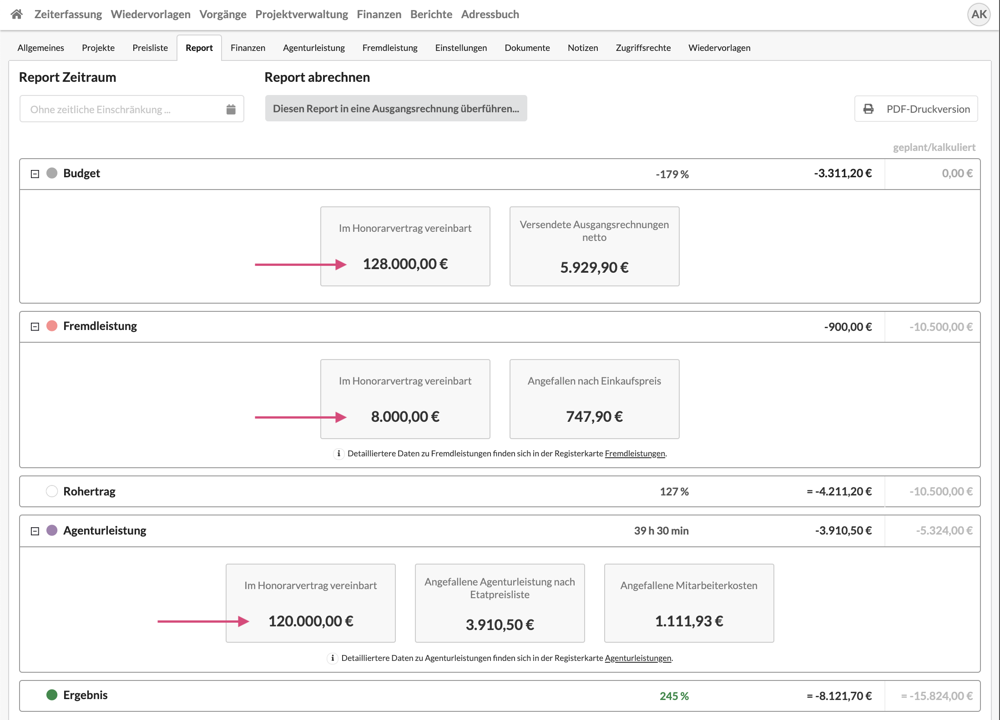
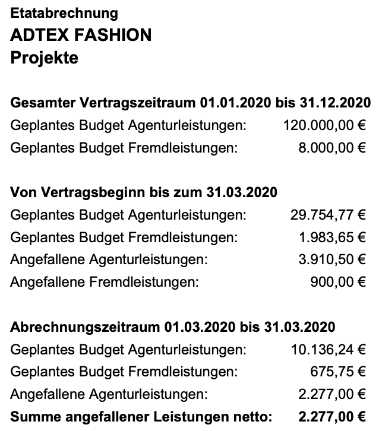

# Auswertung Honorarverträge

## Was sind Honorarverträge?

Besteht ein Etat aus mehreren Projekten, die alle unabhängig voneinander angeboten und abgerechnet werden, die in ihrer Gesamtheit jedoch in einen Vertragsrahmen fallen, kann an dieser Stelle **Honorarvertrag** ausgewählt werden. Ein Honorarvertrag verfügt über einen Zeitraum sowie ein Budget für Agentur- und Fremdleistungen.


Honorarverträge anzulegen macht dann Sinn, wenn es kein konkretes Leistungsverzeichnis gibt, sondern nur ein Vertragsbudget und ein Zeitrahmen.   
Im Verlauf des Vertrags wird dann sukzessive gemeinsam mit dem Kunden geplant wird, wie das Budget verwendet werden soll.


Die Aushandlung von Honorarverträgen trägt wesentlich zur Liquiditätssicherung der Agentur bei.

Die Bugets von Honorarverträgen können mit den angefallenen Leistungen auf den Projekten eines Honorarvertragsetats in der Ansicht **Auswertung Honorarverträge** gegenübergestellt werden.

## Auswertung von Honorarverträgen

## Anzeige von Honorarvertragsdaten im Etat-Report

Im Reiter "Report" eines Etats werden auch Honorarvertragseckdaten angezeigt. 

  
Die Report-Druckversion des Etats kann rechts oben geöffnet werden.  
Sie führt im Honorarvertrag vereinbarte und angefallene Budgets auf.

In diesem Beispiel zeigen wir den Etat-Report des Etats "Projekte" unseres Kunden ADTEXT FASHION mit dem wir einen einjährigen Honorarvertrag für das Jahr 2020 vereinbart haben.  
Der Ausgewählte Report-Zeitraum ist März, dieser Zeitraum wird in der Druckversion als "Abrechnungszeitraum" angezeigt. 

Dieses Dokument kann zum Beispiel monatlich erstellt und zusammen mit der Rechnung als Etatkontoübersicht mit an den Kunden versendet werden.

