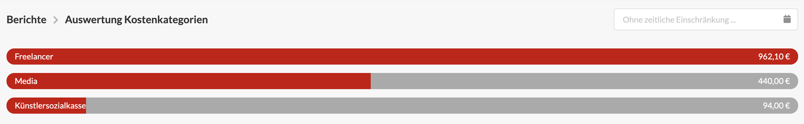

# Auswertung Kostenkategorien

Dieser Bericht zeigt die kumullierten Summen sowie das Verhältnis einer Kostenkategorie am Gesamtanteil aller mit Kategorien versehenden Kosten des Unternehmens im ausgewählten Zeitraum - z.B. letztes Jahr. Der Zeitraum lässt sich rechts oberhalb der Liste einstellen.


**Anwendungsbeispiele für Kostenkategorien**  
Gehälter, Bürokosten, Freelancer Art, Freelancer Development, Bildlizenzen, Reisekosten


Die Auswertung von Kostenkategorien kann z.B. bei der Entscheidung helfen ob es sich lohnt Personal für Leistungen einzustellen, die bisher von Freelancern geliefert wurden oder laufende Kosten für Miete, Büro, Fahrzeugflotte auf den einzelnen Mitarbeiter umzulegen.

