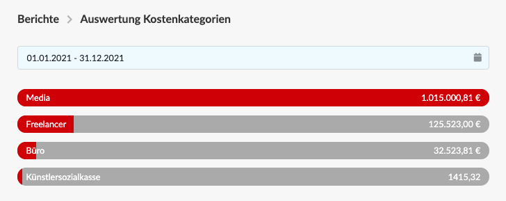

# Auswertung Kostenkategorien

Dieser Bericht zeigt die kumulierten Summen aller mit Kategorien versehenden Kosten des Unternehmens im ausgewählten Zeitraum - z.B. einem Jahr - im Verhältnis zueinander an.

### Auswertung des Zeitraums

Der Auswertungs-Zeitraum lässt sich frei einstellen und bezieht sich auf den Leistungzeitraum einer jeweiligen Eingangsrechnung oder Gutschrift.


**Beispiel: Teilweise Überschneidung von Leistungszeiträumen**  
Wir haben eine Media-Rechnung von Youtube erhalten und buchen diese ins System ein und vermerken   
a\) den Leistungszeitraum "01.Juli - 31August 2021"  
b\) die Erlöskategorie "Media" und  
c\) den Betrag "2.000,- EUR"  
  
Werten wir nun den Zeitraum Juli aus, werden lediglich 1.000 EUR in unserem Bericht berücksichtigt, da der Auswertungszeitraum Juli nur 50% des Leistungzeitraums unserer Youtube-Rechnung entspricht.


### Anwendungsbeispiele für Kostenkategorien


**Beispiele für gängige Kostenkategorien**  
Media, Gehälter, Bürokosten, Freelancer Art, Freelancer Development, Bildlizenzen, Reisekosten, 


Die Auswertung von Kostenkategorien kann z.B. bei der Entscheidung helfen, ob es sich lohnt Personal für Leistungen einzustellen, die bisher von freien Mitarbeitern geliefert wurden oder laufende Kosten für Miete, Büro, Fahrzeugflotte auf den einzelnen Mitarbeiter umzulegen.   
Ebenso lässt sich anhand von Kostenkategorien erwägen ob es evtl. Sinn macht ein anderes Reisebüro zu beauftragen oder Leistungen, die bisher inhouse erbracht werden, auszulagern.

