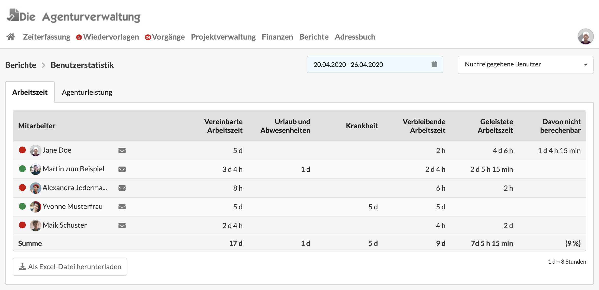

# Benutzerstatistik

Im Reiter "Arbeitszeit" der Benutzerstatistik lässt sich auf einen Blick erkennen, ob alle im Team ihre Zeiten erfasst haben.

In diesem Video werden die Kennzahlen und Funktionen der Benutzerstatistik erläutert.



