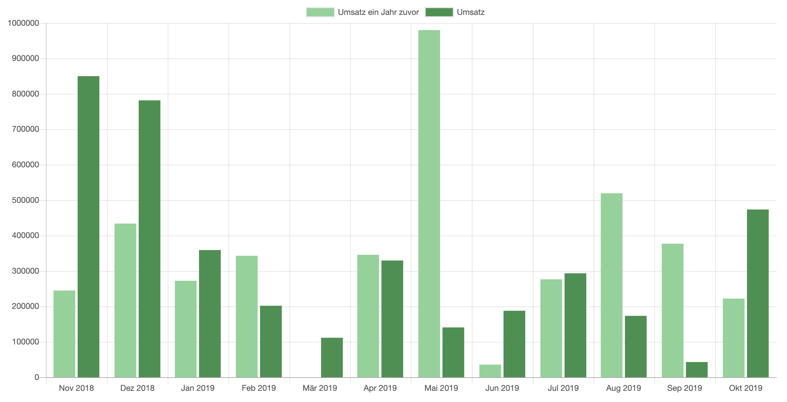
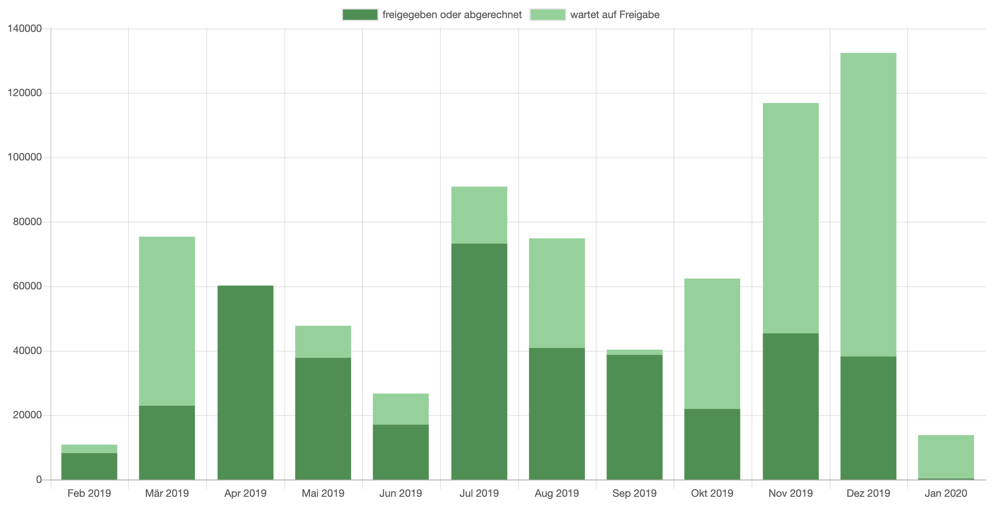
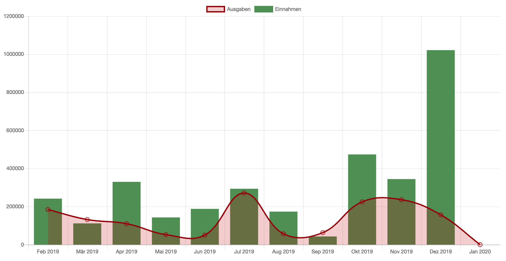
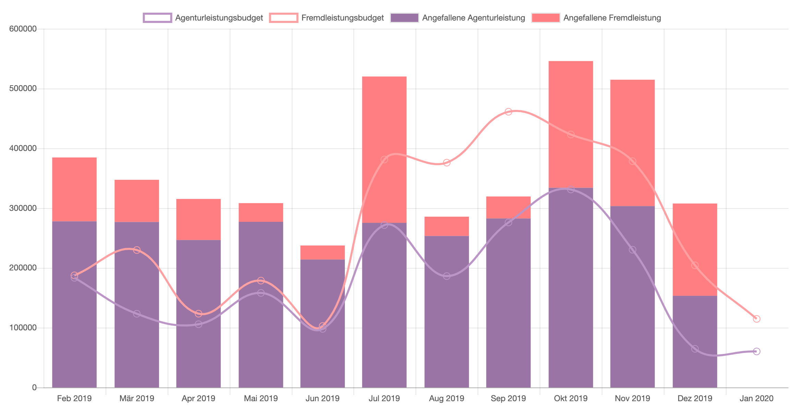
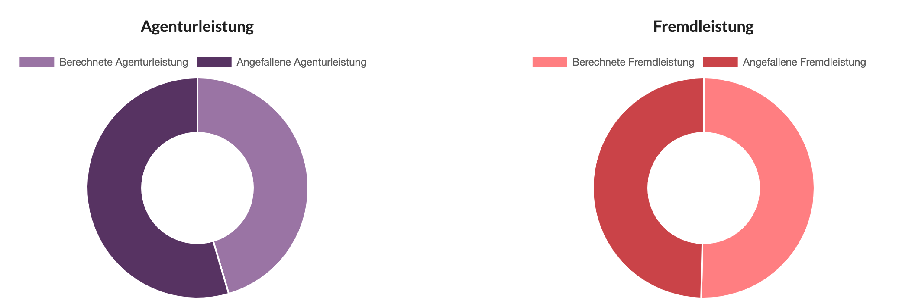

# Jahresrückblick

Fängt eure Unternehmen gerade erst an Die Agenturverwaltung zu nutzen, kann im Bericht Jahresrückblick noch nicht viel abgelesen werden. Er wird im Verlauf der Zeit jedoch immer wertvoller und hilft dabei langfristige Entwicklungen zu erkennen.

Die Folgenden Beispiel-Diagramme zeigen wie sich der Bericht verhält, wenn Daten vorhanden sind.

## Umsatz im Vorjahresvergleich

In dieser Darstellung werden alle Umsätze aus projektbezogenen Ausgangsrechnungen mit Status "versandt" abzüglich des Umsatzes projektbezogener versendeter Gutschriften gezeigt.

Die Werte fallen gemäss ihres Rechnungsdatums in die entsprechenden Monate. Leistungszeiträume werden nicht berücksichtigt.

Der hellere Balken zeigt dabei den Wert des jeweilgen Vorjahres als Trend an.

Oberhalb der Grafik kann der Ausgangsmonat (normalerweise der aktuelle Monat) eingestellt werden. D.h. es ist möglich die Ansicht auch noch ein oder zwei Jahre in die Vergangenheit zu verlagern.

Wird ein Benutzerdefinierter Filter angewendet, beziehen sich die Daten lediglich auf die Kunden, Etats und Projekte, die in diesem Filter definiert wurden.

## Kostenvoranschlagsvolumina

In dieser Darstellung werden alle Umsätze aus projektbezogenen Kostenvoranschlägen gezeigt.

Die Werte fallen gemäss ihres Datums in die entsprechenden Monate. Leistungszeiträume werden nicht berücksichtigt.

Oberhalb der Grafik kann der Ausgangsmonat (normalerweise der aktuelle Monat) eingestellt werden. D.h. es ist möglich die Ansicht auch noch ein oder zwei Jahre in die Vergangenheit zu verlagern.

Wird ein Benutzerdefinierter Filter angewendet, beziehen sich die Daten lediglich auf die Kunden, Etats und Projekte, die in diesem Filter definiert wurden

## Budget und Fixkosten

In die monatlichen Werte fließen die Netto-Budgets projektgebundener Kostenvoranschläge **nach Leistungszeitraum** ein. Es werden nur Kostenvoranschläge, deren Freigabe in die ausgewählten Wahrscheinlichkeiten fällt, die freigegeben oder abgerechnet sind berücksichtigt. Die rote Linie repräsentiert die wiederkehrenden Agenturfixkosten (z.B. Miete, Gehälter, Fahrzeugflotte, ...) die nicht bestimmten Projekten zugeordnet sind. Sie sollte den Agenturleistungsanteil nicht übersteigen.&#x20;

Mehr zu Thema Fixkosten, wie sie sich zusammensetzen, und wie man sie definieren kann, steht hier:


[agenturfixkosten.md](../einstellungen-1/finanzen/agenturfixkosten.md)



**Hinweis:**\
Abzüge wie Rabatte und Markup in Kostenvoranschlägen sind _nicht leistungsspezifisch_ und werden in dieser Ansicht nicht berücksichtigt.


Oberhalb der Grafik kann der Ausgangsmonat (normalerweise der aktuelle Monat) eingestellt werden. D.h. es ist möglich die Ansicht auch noch ein oder zwei Jahre in die Vergangenheit zu verlagern.

Wird ein Benutzerdefinierter Filter angewendet, beziehen sich die Daten lediglich auf die Kunden, Etats und Projekte, die in diesem Filter definiert wurden.

Der Wahrscheinlichkeitsfilter bezieht sich auf die Wahrscheinlichkeit von geplanten Budgets. Es können auch mehrere Wahrscheinlichkeiten z.B. "sicher" _und_ "wahrscheinlich" ausgewählt werden.

## Einnahmen und Ausgaben

In die monatlichen Werte fließen die Netto-Summen aller Eingangs-, Ausgangs-, Stornorechnungen sowie Gutschriften unabhängig vom Zahlungseingang ein. Hier werden explizit auch** nicht projektgebundene Rechnungen** z.B. Miete, Internet etc. berücksichtigt.

Oberhalb der Grafik kann der Ausgangsmonat (normalerweise der aktuelle Monat) eingestellt werden. D.h. es ist möglich die Ansicht auch noch ein oder zwei Jahre in die Vergangenheit zu verlagern.

## Budget und angefallene Leistung

Diese Grafik stellt kalkulierte oder geplante Budgets und angefallene Leistungen in ihren jeweiligen Liefer- bzw. Leistungszeiträumen gegenüber.


**Hinweis**\
****Abzüge in Kostenvoranschlägen sind nicht leistungsspezifisch und werden hier nicht berücksichtigt.


Oberhalb der Grafik kann der Ausgangsmonat (normalerweise der aktuelle Monat) eingestellt werden. D.h. es ist möglich die Ansicht auch noch ein oder zwei Jahre in die Vergangenheit zu verlagern.

Wird ein Benutzerdefinierter Filter angewendet, beziehen sich die Daten lediglich auf die Kunden, Etats und Projekte, die in diesem Filter definiert wurden.

Der Wahrscheinlichkeitsfilter bezieht sich auf die Wahrscheinlichkeit von geplanten Budgets. Es können auch mehrere Wahrscheinlichkeiten z.B. "sicher" _und_ "wahrscheinlich" ausgewählt werden.

## Geliefert und Berechnet

In dieser Darstellung werden alle projektgebundenen gelieferten Leistungen den tatsächlich berechneten Leistungen gegenübergestellt.

Angefallene Agenturleistungen sind Zeiterfassungseinträge die zu den jeweils mit dem Kunden vereinbarten Stundensätzen geliefert wurden.

Berechnete Agenturleistungen sind die Teile von projektgebundenen Ausgangsrechnungen deren Positionen nicht explizit als Fremdleistung markiert sind.

Angefallene Fremdleistungen sind auf Projekte gebuchte Eingangsrechnungen - unabhängig vom Kostentyp, also vom Umstand ob sie dem Kunden berechnet werden können oder nicht. Ausgenommen sind sog. "durchlaufende" Fremdleistungen.

Berechnete Agenturleistungen sind die Teile von projektgebundenen Ausgangsrechnungen deren Positionen als Fremdleistung markiert sind.

Oberhalb der Grafik kann der Ausgangsmonat (normalerweise der aktuelle Monat) eingestellt werden. D.h. es ist möglich die Ansicht auch noch ein oder zwei Jahre in die Vergangenheit zu verlagern.

Wird ein Benutzerdefinierter Filter angewendet, beziehen sich die Daten lediglich auf die Kunden, Etats und Projekte, die in diesem Filter definiert wurden.
