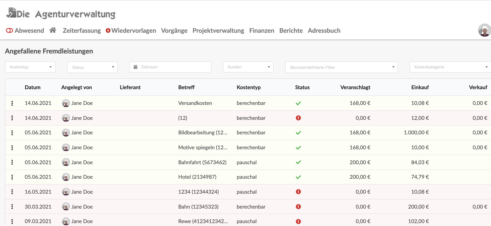

# Kundenübergreifende Fremdleistungsliste

Unter Berichte > Fremdleistungen findet sich eine Modul mit zahlreichen Filtermöglichkeiten um angefallene Fremdleistungen kundenübergreifend zu zu finden und zu analysieren.

Der Liste lässt sich mitsamt den Filtereinstellungen auch als **Excel-Datei** exportieren und mit anderen Programmen weiterverarbeiten.


**Hinweis: **\
****Der Filter "Zeitraum" bezieht sich auf das Abrechnungsdatum jeder einzelnen Fremdleistung.

