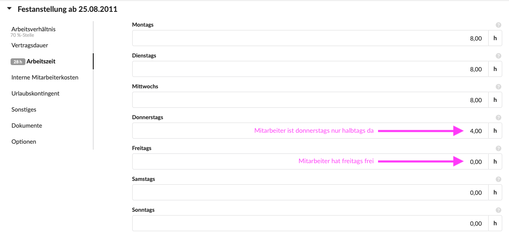
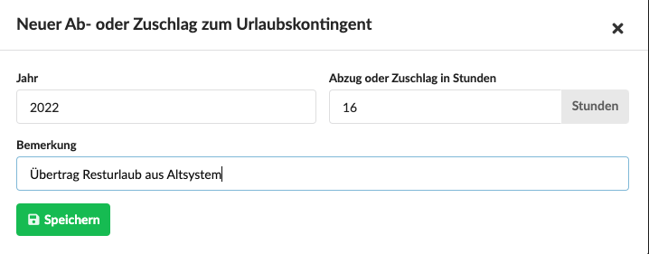

# Arbeitsverhältnisse

### Was sind Arbeitsverhältnisse?

Damit die Zeiterfassung, die Wochenansicht der Vorgänge und der Abwesenheitskalender auch anzeigen können, an welchen Tagen ein Mitarbeiter arbeitet, kann ein Mitarbeiter als "Festangestellt" geführt werden. Das geht im Reiter "Arbeitsverhältnis".

> Ohne Arbeitsverhältnis taucht der Mitarbeiter im Abwesenheitskalender und in der Wochenansicht der Vorgänge als "abwesend" auf.

### Vertragsdauer und Vertragsänderungen

Ein Arbeitsverhältnis kann ohne Enddatum oder befristet sein. Es können für einen Nutzer auch mehrere Arbeitsverhältnisse in einem zeitlichen Ablauf aufeinanderfolgen.


**Ein Beispiel**  
Eure Auszubildende hat ein Vollzeit-Arbeitsverhältnis mit euren Unternehmen während der Ausbildung, im Anschluss beginnt sie bei euch mit einer halben Stelle.  
In diesem Fall beendet ihr das Arbeitsverhältnis der Ausbildung und erstellt ein neues Arbeitsverhältnis im direkten Anschluss.  
In diesem neuen Arbeitsverhältnis wird der Interne Mitarbeiterkostensatz, die Wochenarbeitszeit und ggf. der Urlaubsanspruch an den neuen Arbeitsvertrag angepasst.


### Interner Mitarbeiterkostensatz

Am Arbeitsverhältnis kann auch der interne Stundensatz hinterlegt werden. Er wird lediglich für Auswertungen verwendet um Arbeitszeit in Projekten nach internen Stundensätzen zu bewerten.

Nur Administratoren und explizit berechtigte Nutzer können diese Kennzahlen in Auswertungen auch sehen.


**Den internen Stundensatz sollte euer Steuerberater ermitteln**

Er sollte neben dem Gehalt auch indirekte Kosten wie Büro, Lohnnebenkosten, Fahrzeugflotte und vor allem den Leerlauf, also nicht verkaufte Leistung enthalten.  
Bei den meisten Agenturen liegt dieser Wert zwischen 40 und 80 EUR.  
  
Bei **Freien Mitarbeitern \(Freelancer\)** könnte beispielsweise der vereinbarte Stundensatz und ggf. eine Pauschale für einen Büroplatz angesetzt werden sofern euer Unternehmen Freelancern Arbeitsplätze vor Ort zur Verfügung stellt.


**Die folgenden Einstellungen betreffen lediglich festangestellte Mitarbeiter:**

### Wochenarbeitszeit & Teilzeitverträge

Am Arbeitsverhältnis kann hinterlegt werden, wieviele Stunden ein Mitarbeiter an welchen Wochentagen normalerweise arbeitet.

Ist ein Mitarbeiter Freitags z.B. nicht da wird für von Montag bis Donnerstag z.B. "8 Stunden" hinterlegt und am Freitag 0.

Für Mitarbeiter, die an bestimmten Tagen z.B. nur halbtags da sind, werden an diesen Tagen z.B. "4 Stunden" hinterlegt.

### Urlaubskontingent

Das hier hinterlegte Urlaubs- und Sonderurlaubskontingent bezieht sich auf ein Jahr, unabhängig davon wann der Vertrag beginnt oder endet \(das System errechnet das Kontingent für bestimmte Zeiträume entsprechend selbst\).

#### Sonderurlaub

Unter Sonderurlaub versteht sich der gesetzliche Anspruch auf  - üblicherweise bis zu zwei - zusätzliche Urlaubstage z.B. für Hochzeiten, Beerdigungen, Behördentage oder Umzug.

**Nicht verbrauchtes Sonderurlaubskontingent wird nicht ins Folgejahr übertragen sondern verfällt.**

#### Resturlaub

Beim Urlaubskontingent kann Resturlaubs ins Folgejahr übertragen werden. Dafür kann eine Frist \(das Verfallsdatum, meist der 31.03 des Jahres\) angegeben werden.


**Resturlaub deaktiveren**  
Ist die Frist für Resturlaub auf 01.01. eingestellt, verfällt jeglicher Resturlaub aus diesem Arbeitsverhältnis mit dem Jahreswechsel.


#### Abzüge und Zuschläge zum Urlaubskonto

Um Sonderfälle zu ermöglichen können für eine Bestimmtes Jahr Abzüge oder Zuschläge zum Urlaubskonto angegeben werden.


**Ein Beispiel**  
Katrin hat zwei Tage Resturlaub \(er verfällt am 31.03\) zu spät genommen und wir möchten ihr am 01. und 02. April die Möglichkeit \(als Ausnahme von der Regel\) einräumen, diese beiden Tage noch vom Resturlaubskontingent zu nehmen.  
Dafür tragen wir bei den Ab- und Zuschlägen für dieses Jahr einen Zuschlag von 16 Stunden ein. Dieser wirkt sich wie zusätzlicher Urlaub aus und wird nicht ins nächste Jahr übertragen.  
D.h. die beiden Tage verfallen zwar, wir gewähren Katrin dafür einen Zuschlag von 2 Tagen.


#### Migration von Resturlaub aus einem Alt-System

Damit Resturlaub aus einem Alt-System in Die Agenturverwaltung übertragen werden kann, können wir den Resturlaub am Arbeitsverhältnis jedes Mitarbeiters für das aktuelle Jahr als Zuschlag eintragen.

### Sonstiges: Position, Vorgesetzter, Probezeit

Das Feld Position \(z.B. "Kaufmännischer Leiter"\) dient der Dokumentation.

Wird ein Vorgesetzter  und ein Datum für den Ablauf der Probezeit hinterlegt, wird der Vorgesetzte ca. 14 Tage vor Ablauf dieses Datums per E-Mail an den Ablauf erinnert.

### Dokumente

Hier können Dokumente hochgeladen werden, beispielsweise der Arbeitsvertrag, ein unterschriebener NDA, Gesprächsprotokolle oder Zielvorgaben.

