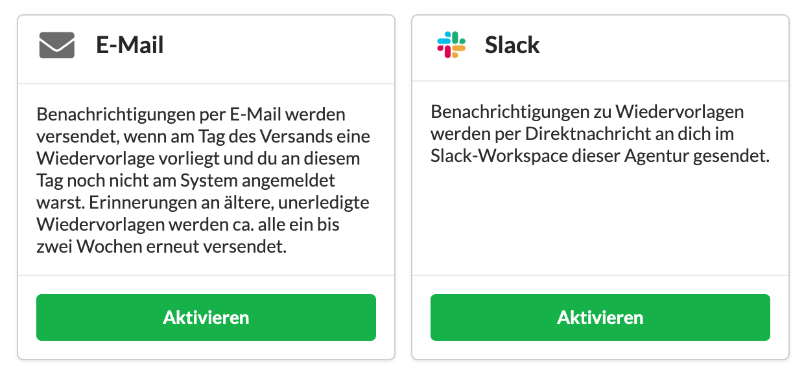

# Benachrichtigungen

Unter Einstellungen &gt; Benutzerverwaltung &gt; Mein Profil oder in den Benutzerdetails unter "Profileinstellungen" können die Benachrichtigungsarten eines Nutzers eingestellt werden.

Nutzer erhalten gelegentlich vom System E-Mails. Ist dies nicht gewünscht, kann diese Benachrichtigungsart hier deaktiviert werden.

