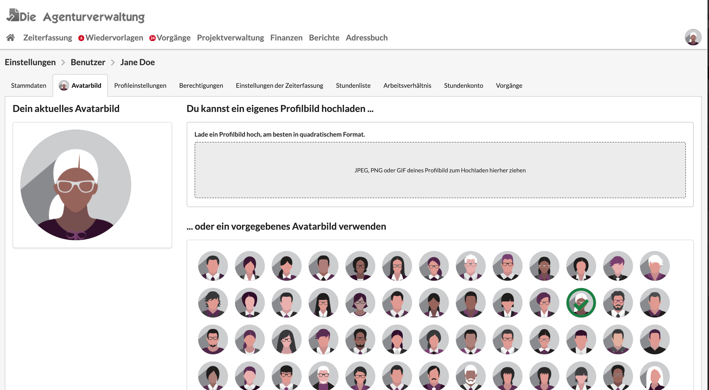
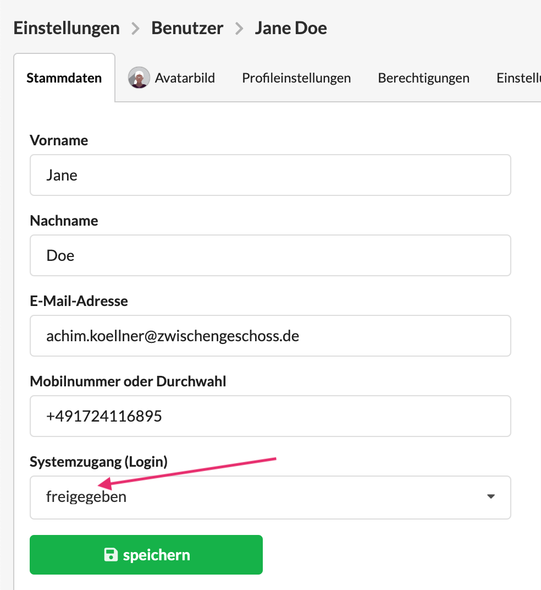
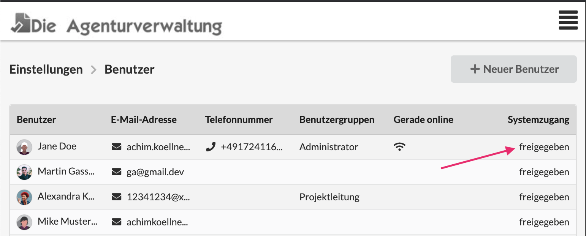

# Benutzer bearbeiten

### Avatarbilder

Nutzer können ein Profilbild von sich hochladen indem sie über Einstellungen &gt; Benutzerverwaltung &gt; Mein Profil gehen. 

Alternativ zu einem Foto steht auch eine grössere Sammlung von fertigen Avatar-Grafiken bereit. Die Auswahl eines Avatars erfolgt einfach per Klick.

Administratoren können dies auch für einen anderen Benutzer in den Benutzereinstellungen erledigen.

### Profileinstellungen: Hilfe & Benachrichtigungen

Unter Einstellungen &gt; Benutzerverwaltung &gt; Mein Profil oder in den Benutzerdetails unter "Profileinstellungen" können die Benachrichtigungsarten eines Nutzers eingestellt werden.

Nutzer erhalten gelegentlich vom System E-Mails. Ist dies nicht gewünscht, kann diese Benachrichtigungsart hier deaktiviert werden.

Ebenso können die Hilfe-Texte die bei manchen Seitenelementen erscheinen hier deaktiviert werden.

### Einstellungen der Zeiterfassung

#### Funktionen

Damit ein Nutzer Zeit erfassen kann, muss ihm mindestens eine Funktion zugewiesen sein, da jeder Zeiterfassungseintrag die Aktivität eines Nutzer in seiner Funktion dokumentiert.

Du kannst über die Shortcuts über der Liste entweder alle oder kein Funktion zuordnen. Da ein Nutzer nicht keiner Funktion zugewiesen sein kann, wird hier die erste Funktion ausgewählt.

Falls hier noch gar keine Funktionen zu finden sind, lege zunächst die Agenturpreisliste an.

Hier steht, warum und wie das geht:



#### Tätigkeiten

Einem Nutzer können - müssen jedoch nicht - Tätigkeiten für regelmässig wiederkehrende Aktivitäten zugewiesen sein. Diese Tätigkeiten kann er dann in der Zeiterfassung beim seinen Einträgen auswählen und nutzen. 

Über die Shortcuts oberhalb der Liste können in einem Schritt alle oder keine Tätigkeit zugewiesen werden.

Generell ist die Verwendung von Tätigkeiten optional.

Was es mit Tätigkeiten im Detail auf sich hat, und wo sie angelegt werden steht hier:



### Arbeitsverhältnisse definieren

### Einen Benutzer freigeben und sperren ohne ihn zu löschen

Ein aktiver Benutzer kann gesperrt werden, er kann sich dann nicht mehr am System anmelden.

Ob ein Nutzer freigegeben ist oder nicht sehen Administratoren in der Liste der Benutzer. Dort ist auch erkennbar ob ein Nutzer gerade am System angemeldet ist und damit arbeitet.


**Hinweis:** Auch gesperrte Nutzer sind kostenpflichtig. Wenn ein Nutzer zur Zeit nicht für dein Unternehmen arbeitet, kannst du ihn einfach löschen und später ggf. wiederherstellen. Das kann eine Ersparnis zur Folge haben.


