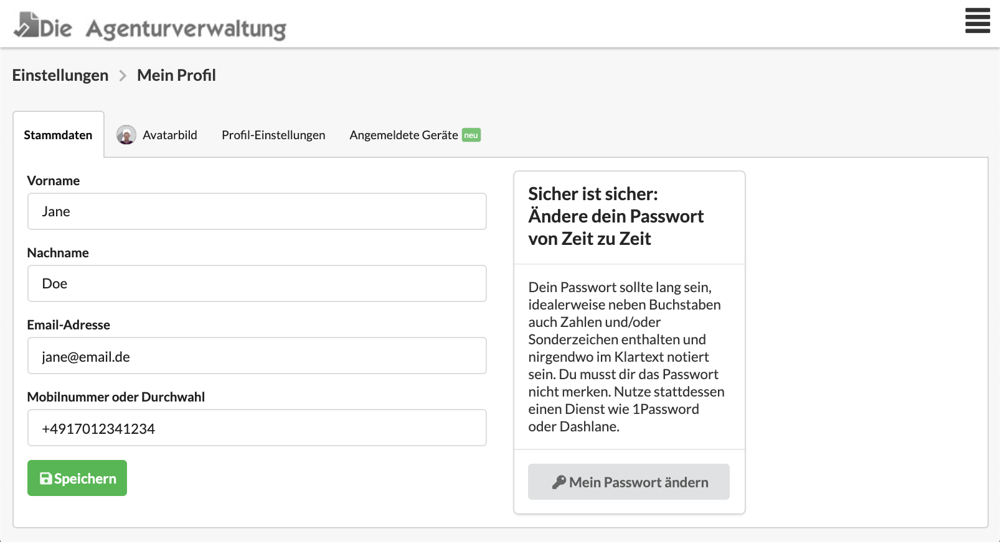
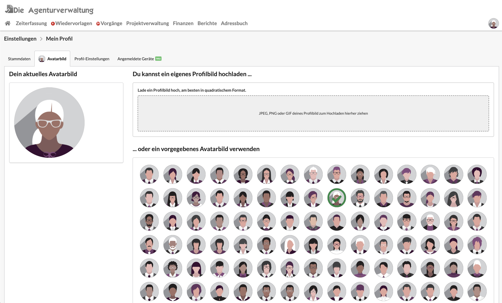
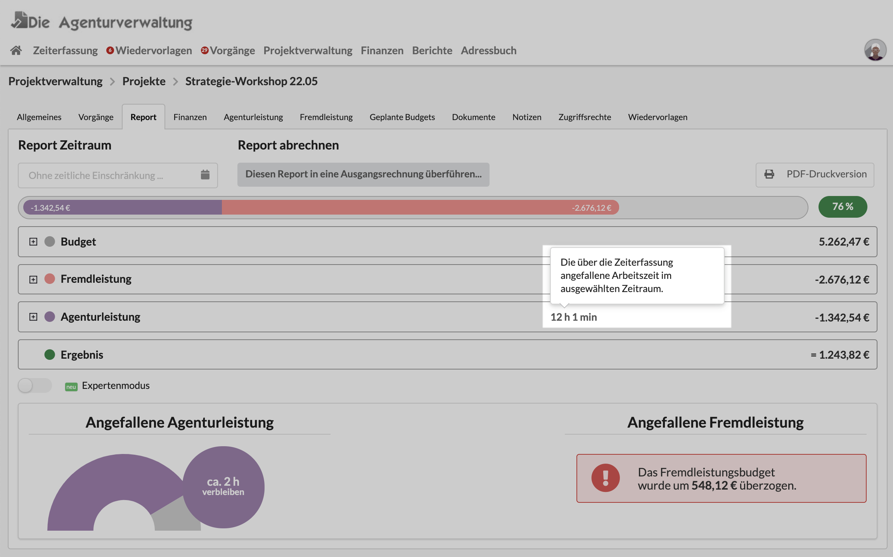
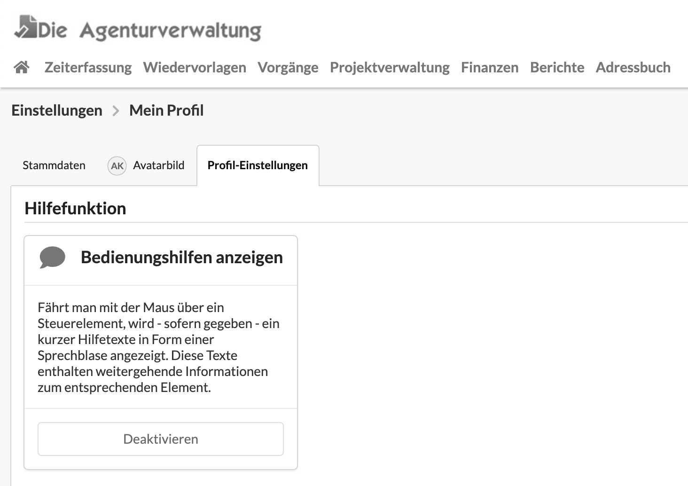
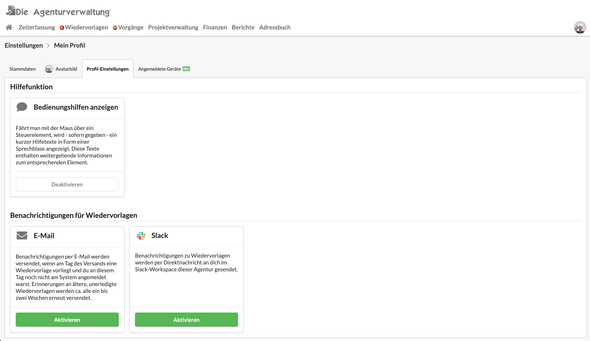
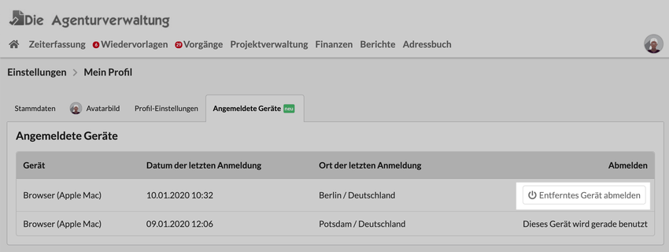

# Mein Profil

## Meine Stammdaten

Im Reiter Stammdaten kannst du deinen Namen, deine E-Mail-Adresse und Telefonnummer konfigurieren.

Im Menu rechts hast Du auch die Möglichkeit dir ein **neues Passwort** zu setzen.&#x20;


**Wir empfehlen explizit die Erneuerung des Passworts in regelmässigen Abständen**. \
Sprich hierzu eure IT auf das bei euch übliche Verfahren an.


Weitere Infos zum Thema Passwortsicherheit findest Du hier:


[am-system-anmelden.md](../../erste-schritte-1/am-system-anmelden.md)


## Profilbild hochladen: Dein Avatar

Avatarbilder verbessern die Übersicht für alle Nutzer. Daher können Mitarbeiter nun ein Bild von sich hochladen oder ein generisches Avatarbild auswählen.

## Hilfe-Sprechblasen deaktivieren

Die Agenturverwaltung bietet an vielen Stellen kleine Hilfetexte zu bestimmten Elementen, z.B. Eingabefeldern oder Schaltflächen.

Diese Hilfetexte tauchen in Form von Sprechblasen am entsprechenden Element auf wenn man mit der Maus darüber fährt.

### Hilfe deaktivieren

Unter "Einstellungen > Mein Profil" im Reiter "Profil-Einstellungen" kann die Anzeige dieser Bedienungshilfen für deinen Benutzer aktiviert und deaktiviert werden.

## Benachrichtigungseinstellungen

Entscheide ob dir Die Agenturverwaltung Benachrichtigungen z.B. zu fälligen Wiedervorlagen per E-Mail oder per Slack oder gar nicht sendet.

## Meine angemeldeten Geräte erkennen und entfernte Geräte abmelden

Wenn du dich beispielsweise gestern in einem Internetcafé auf einem öffentlichen Browser angemeldet  und vergessen hast, dich wieder abzumelden, kannst du das in deinem Profil tun.

Dazu klickst du wieder auf das Einstellungsmenü (oben rechts) und dann auf "Einstellungen". Im nächsten Schritt klickst du auf die Kachel "Mein Profil". Dort öffnest du den Reiter "Angemeldete Geräte". Hier kannst du dich mit einem Klick von dem (entfernten) Gerät abmelden, in diesem Beispiel vom entfernten Rechner eines Internetcafés in Berlin.

