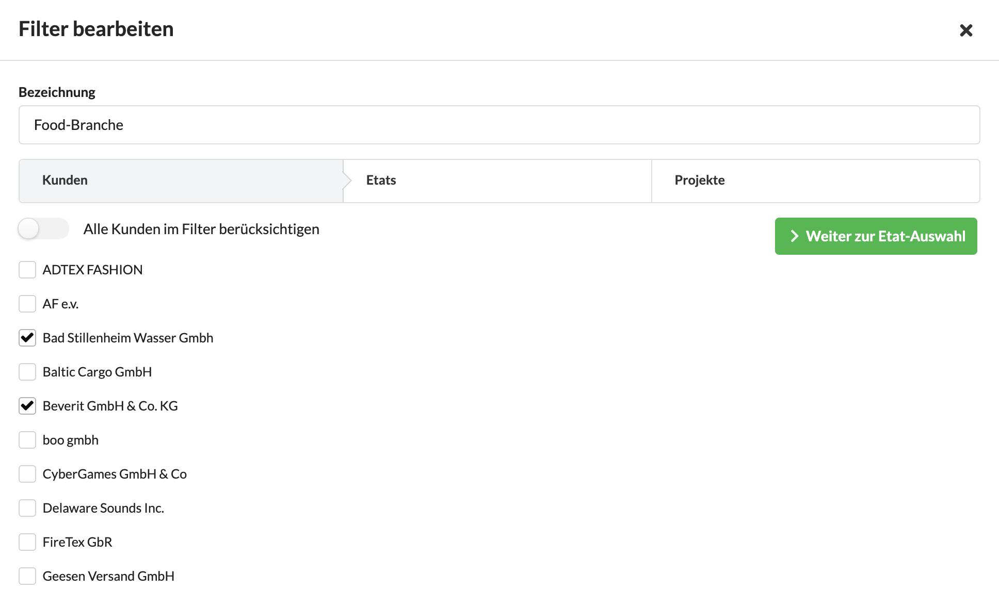

# Benutzerdefinierte Filter

Benutzerdefinierte Filter können - wie der Name sagt - vom Benutzer angelegt werden.

Sie stehen dann an verschiedenen Stellen im System zur Verfügung, z.B. bei den Benutzerdefinierten Berichten, im Jahresrückblick und in verschiedenen anderen statiststischen Auswertungen.

Ein Benutzerdefinierter Filter schränkt eine Ergebnismenge eines Berichts ein auf das was im Filter deklariert wurde.  
Wir können so z.B. den Filter "Automotive" auf einen Umsatz-Jahresbericht anwenden und erkennen, wieviel Umsatz unser Unternehmen in der Automobilsparte gemacht hat.

### Anwendungsbeispiele für Benutzerdefinierte Filter

#### Filter "Food-Branche"

Ein Filter "Food-Branche" könnte nur unsere Kunden aus der Food Branche mit all ihren Etats und Projekten beinhalten.

#### Filter "Reiskosten"

Wenn ihr für jeden Kunden ein Reisekosten-Projekt anlegt, kannst du einen Benutzerdefinierten Filter anlegen, der alle Kunden und alle Etats berücksichtigt, jedoch nur die Projekte mit dem Namen "Reisekosten" aller Kunden auswertet.

#### Filter "Retainergeschäft"

Wenn ihr euren Kunden zwei Etats führt - einen für Projektgeschäft, den anderern für Retainer, also Honorargeschäft mit z.B. Jahresverträgen - könnt ihr einen Benutzerdefinierten Filter anlegen, der alle Kunden, aber nur die Retainer-Etats mit deren Projekten berücksichtigt.

#### Filter "Team Media Production"

Euer Unternehmen hat Teams und teilt Kunden unter diesen auf? Dann macht es Sinn einen Benutzerdefinierten Filter für jedes Team anzulegen und die Kunden des Teams mit all ihren Etats und Projekten dem Filter zuzuordnen. 

