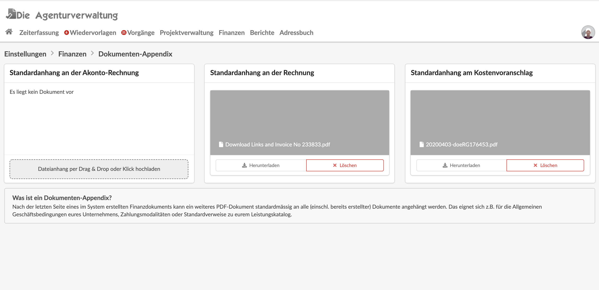

# Dokumenten-Appendix

Für die Druckversion von Akonto-, Ausgangsrechnungen und Kostenvoranschläge kann unter Einstellungen &gt; Finanzen &gt; Dokumenten-Appendix ein PDF hinterlegt werden, dass am Ende jedes Finanzdokuments angehängt wird.

Die Einstellung bezieht sich auch rückwirkend auf bestehende Dokumente.

Wird an einer Ausgangsrechnung der zugehörige Kostenvoranschlag mit ins PDF eingebunden \(siehe Druckversionseinstellungen von Finanzdokumenten\), so erscheint das Appendix-Dokument nach dem Kostenvoranschlag.


**Anwendungsbeispiele**  
Ein Appendix-Dokument könnte z.B. eure Allgemeinen Geschäftsbedingungen, bestimmte Zahlungsmodalitäten oder allgemeine Infos zu euren Produkten und Services enthalten.


