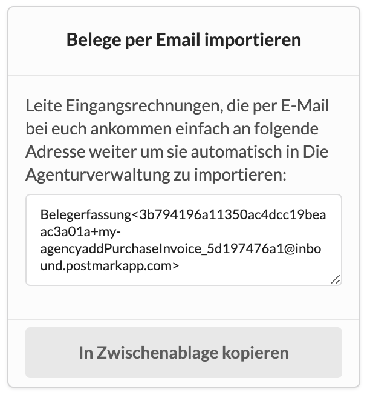

# Eingangsrechnungen per E-Mail in die Agenturverwaltung weiterleiten

Die meisten unserer Mandanten verfügen über ein E-Mail-Postfach das eigens für Rechnungen von Lieferanten zur Verfügung steht. z.B. invoice@my-agency.com oder buchhaltung@meine-agentur.de

Unter "Einstellungen &gt; Finanzen" findet ihr in der Kachel "Belege per Email importieren" ein Feld mit einer Email-Adresse, die in etwa so aussieht:

Eure IT kann alle E-Mails, die an eure rechnungen@...- E-Mail-Adresse gehen, an die E-Mail-Adresse in diesem Feld weiterleiten.

Dadurch werden diese E-Mails mit den angehängten HTML- oder PDF-Rechnungen automatisch in der Agenturverwaltung angelegt. Sie haben dann den Status `wartet auf Erfassung` d.h. sie warten darauf, dass jemand die einzelnen Belege sichtet, überprüft und an den jeweilig zuständigen Projektmanager weitergibt.

Die KI-gestützte Belegerfassung hilft auch hier, die Belege eurer Lieferanten zu erkennen so dass nicht alle Daten mühsam abgetippt werden müssen.


**Tipp**  
Speichere diese E-Mail-Adresse unter dem Namen "Belegerfassung" in deinem Adressbuch. So brauchst Du Rechnungen, die an dein persönliches Postfach gehen, lediglich an "Belegerfassung" weiterzuleiten.


