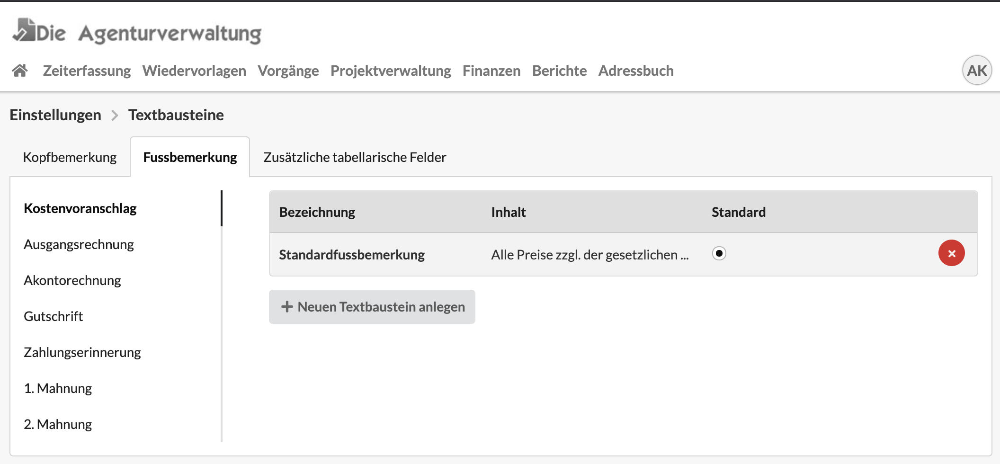
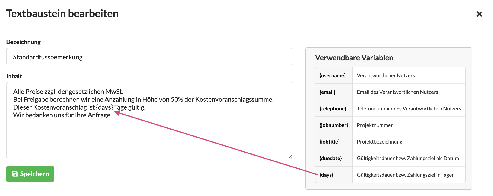
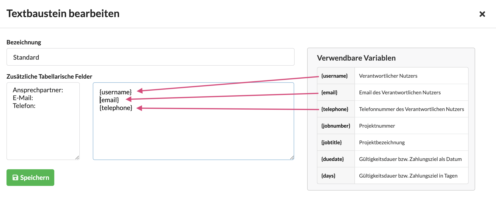
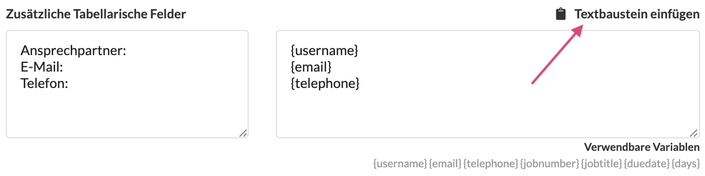
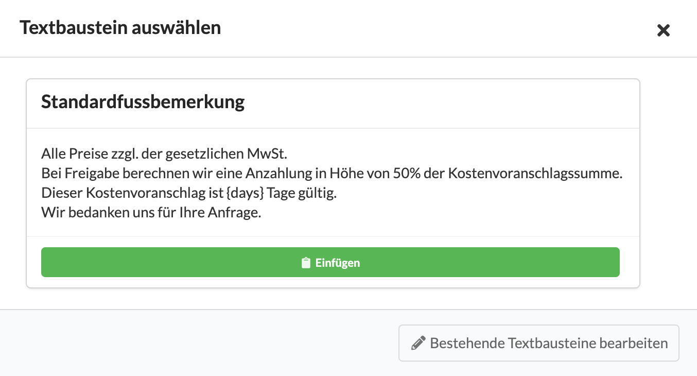

# Textbausteine

## Textbausteine für Kopf- und Fussbemerkung

## Textbausteine für den tabellarischen Kopf eines Finanzdokuments

In Textbausteinen können auch Variablen verwendet werden. Diese werden in der Druckversion dann mit Werten aus dem jeweiligen Dokumentenkontext ersetzt.

Die Werte für die verwendeten Variablen werden automatisch in die Druckversion eingefügt. Im oberen Teil des tabellarischen Blocks erscheinen die aus dem Dokument automatisch ermittelten Werte, im unteren Teil können wir mit den zusätzlichen tabellarischen Feldern die Liste einfach ergänzen:

## Textbausteine einfügen

Sofern Textbausteine konfiguriert sind, erscheint im Finanzdokument an den entsprechenden Stellen eine neue Schaltfläche.

Klick auf die Schaltfläche öffnet einen Dialog der uns erlaubt einen Textbaustein auszuwählen.

## Standardeinstellungen für Textbausteine am Etat definieren

Die Standard-Textbausteine können auch für einen bestimmten überschrieben werden. Dazu werden sie in den Etat-Einstellungen konfiguriert:



