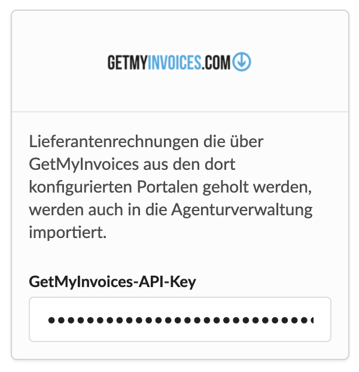

# GetMyInvoices

GetMyInvoices ist eine Platform, mit der Ihr eure regelmässig wiederkehrenden Rechnungen verschiedener Portale automatisiert herunterladen könnt.

[https://www.getmyinvoices.com](https://www.getmyinvoices.com)

Die Lieferanten-Rechnungen, die in diese Platform einlaufen, können auch automatisiert in Die Agenturverwaltung samt Original-Beleg überspielt werden.

**Wie funktioniert das?**

Die Agenturverwaltung sieht stündlich bei GetMyInvoices nach, ob neue Lieferanten-Rechnungen eingegangen sind und kopiert diese in die Eingangsrechnungen der Agenturverwaltung.

Sie stehen dann in der Agenturverwaltung unter Eingangsrechnungen mit dem Status "wartet auf Erfassung" zur Verfügung und können von euch gesichtet und Projekten zugeordnet werden wie jede manuell angelegte Rechnung auch.

**Doubletten werden ignoriert**

Dabei werden Rechnungen die bereits in der Agenturverwaltung existieren \(gleiches Datum und gleiche Rechnungsnummer\) ignoriert.

**So einfach lässt sich die Integration einrichten**

Um Die Agenturverwaltung mit GetMyInvoices zu verbinden, musst Du dir bei GetMyInvoices einen API-Schlüssel generieren. 

Diesen API Schlüssel kannst Du dann in der Agenturverwaltung unter "Einstellungen &gt; Integrationen &gt; GetMyInvoices" eintragen. Fertig.

