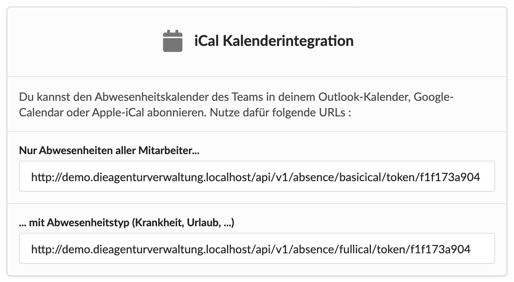
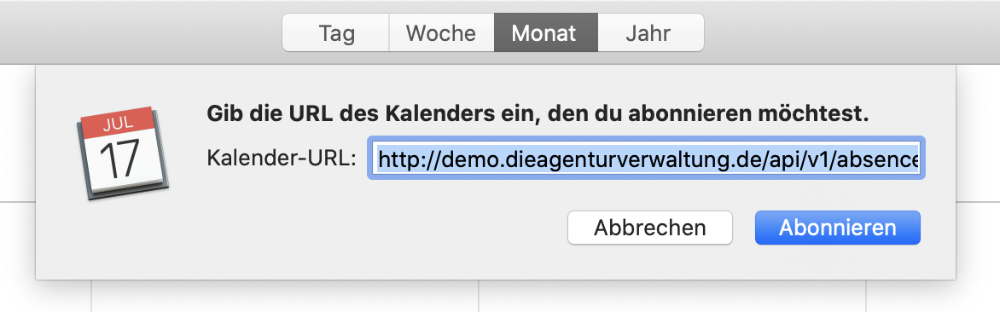
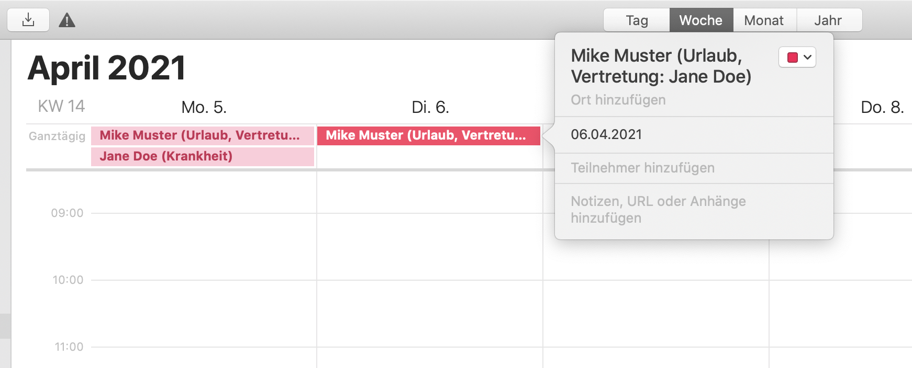
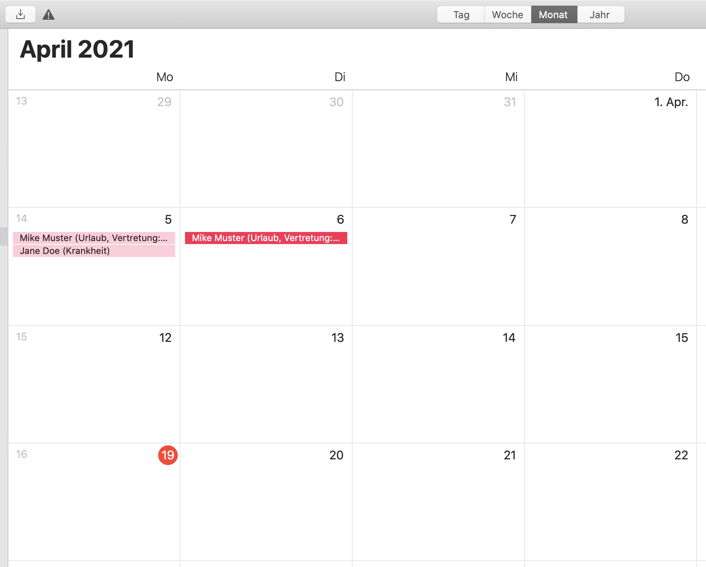

# iCal-Integration

Die Abwesenheiten des Teams können auch als iCal-Kalenderabonnement in deinem Outlook-Kalender, Google-Caledar oder iCal von Apple abonniert werden.

Dazu findest Du entweder unter Einstellungen &gt; Integrationen oder im Abwesenheitskalender diese Karte:

Du kopierst Du die gewünschte URL, legst ein neues Kalenderabonnement in deinem Kalender an:

Hier fügst du die URL für dein Kalenderabonnement ein.

Du kannst bei einigen Programmen noch auswählen, in welchem Intervall dieser Kalender aktualisiert werden soll, z.B. täglich.

Die Abwesenheiten werden dann als ganztägige Termine in deinem Kalender angezeigt.


**Hinweis**  
Kalendereinträge werden maximal bis 6 Monate in die Vergangenheit mit deinem Kalender synchronisiert. Ältere Abwesenheitsdaten findest Du im Abwesenheitskalender in der Agenturverwaltung.


