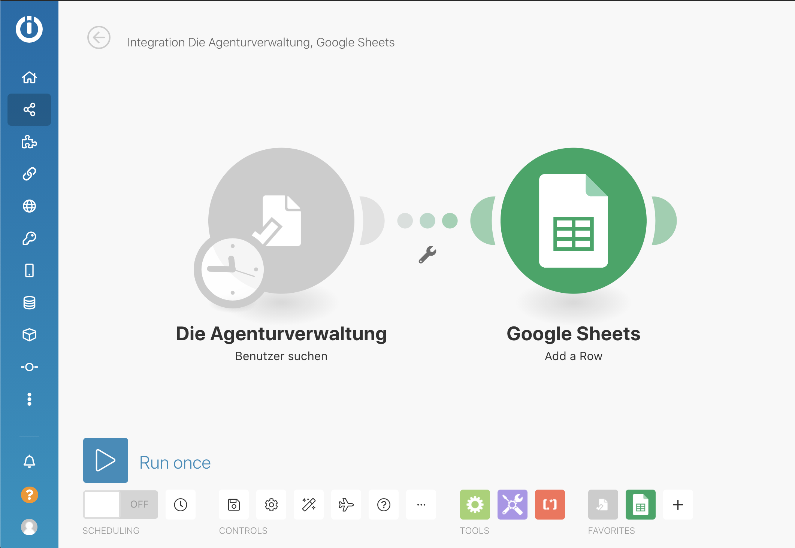
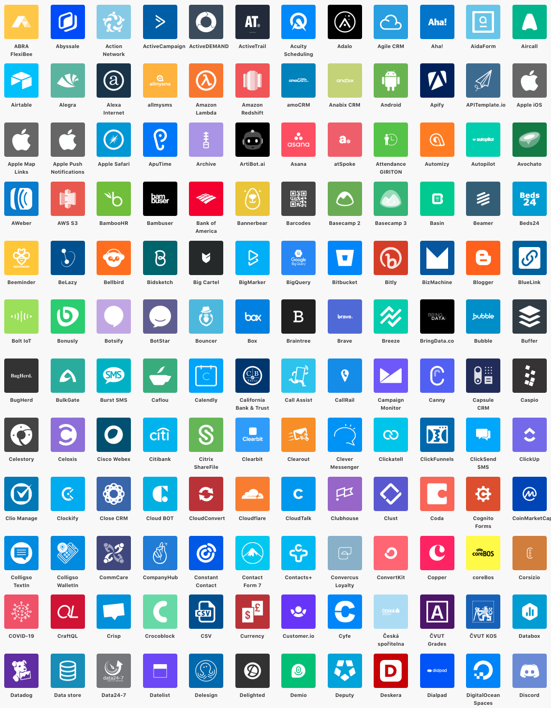
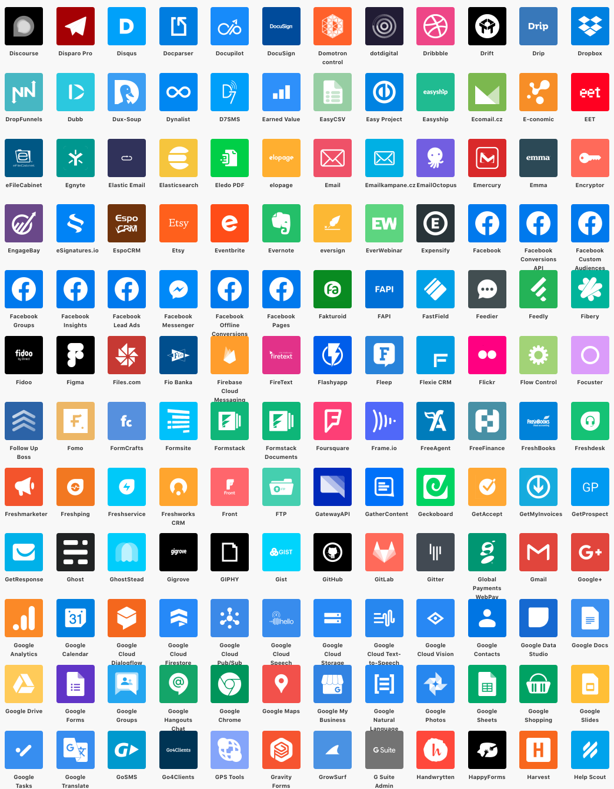
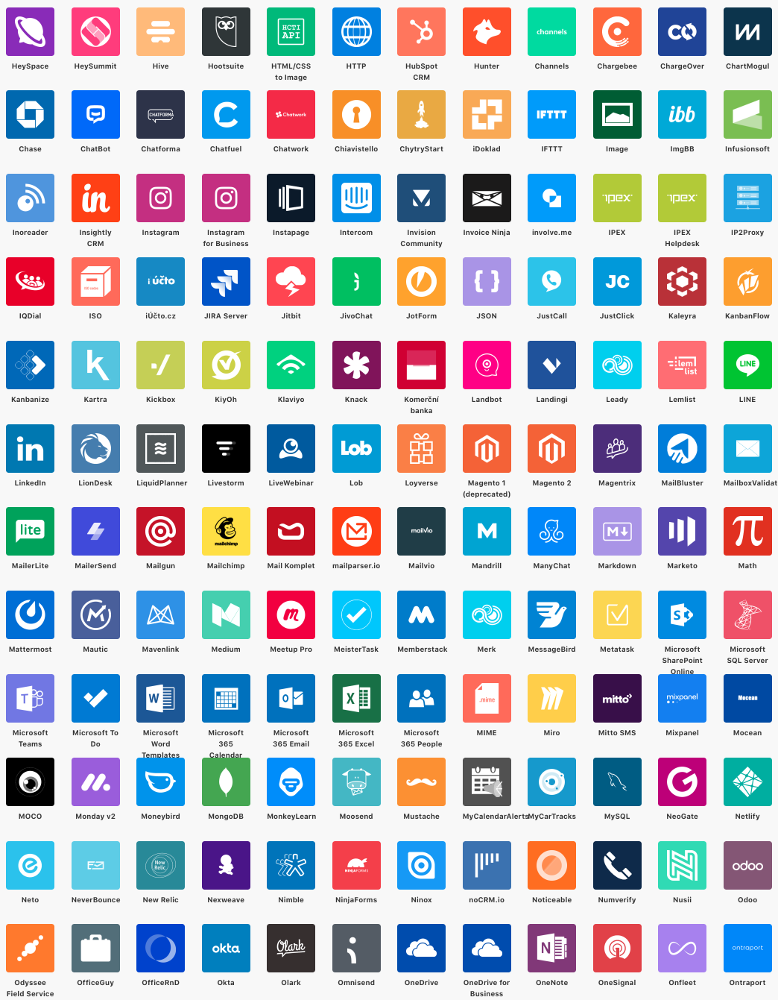
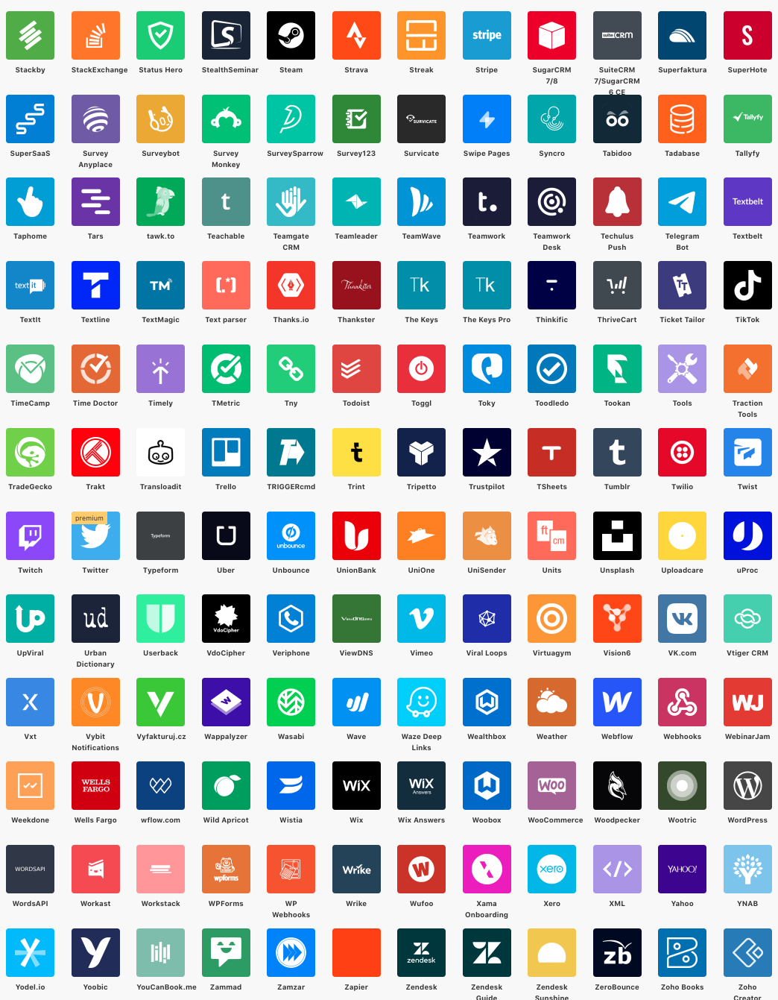
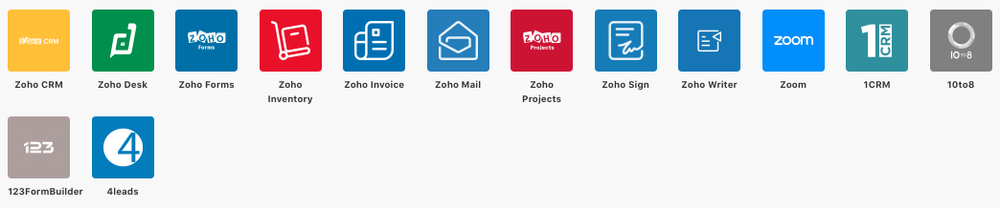

# Integromat

Diese Integration ist in der Beta-Phase und auf Anfrage verfügbar.

Über die Platform [Integromat](https://www.integromat.com/en) können hunderte von 3rd-Party-Apps mit der Agenturverwaltung synchronisiert werden.

Damit zwischen diesen Systemen Daten synchronisiert werden können, bietet Die Agenturverwaltung eine Schnittstelle zur LowCode-Adapter-Platform Integromat.io

Integromat bietet - ähnlich wie Zapier - die Möglichkeit, ohne Programmierkenntnisse Applikationen miteinander zu verbinden. 

### Diese Apps können zur Zeit über Integromat mit der Agenturverwaltung verbunden werden

[https://www.integromat.com/en/integrations](https://www.integromat.com/en/integrations)

Wenn Ihr bereits jetzt Ideen und Vorschläge für die Integrationen anderer Anwendungen habt, lasst uns das gerne wissen: [info@dieagenturverwaltung.de](mailto:info@dieagenturverwaltung.de?subject=Ideen+zu+Integromat)

