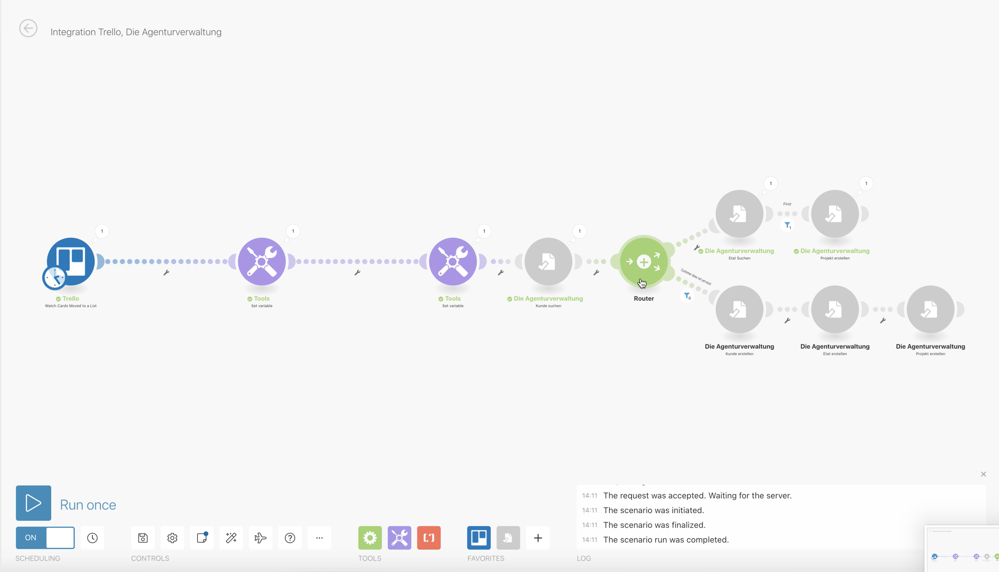

# Beispiel: Trello-Board mit der Agenturverwaltung synchronisieren

Dieses Beispiel zeigt die Integration eines Trello-Boards, auf dem Neugeschäfts-Deals in verschiedenen Phasen liegen.   
Wird eine Deal-Karte in Trello in die spalte "Gewonnen" gezogen, wird in der Agenturverwaltung automatisch ein Kunde, Etat und Projekt angelegt.

Ähnliche Szenarien sind mit CRM-Applikationen wie Hubspot, Pipedrive, Zoho u.v.a. umsetzbar.


**Können wir euch unterstützen?**  
Wir helfen euch gerne bei der Integration verschiedener Komponenten eurer Systemlandschaft. Sprecht uns dazu gerne an: [info@dieagenturverwaltung.de](mailto:info@dieagenturverwaltung.de)


