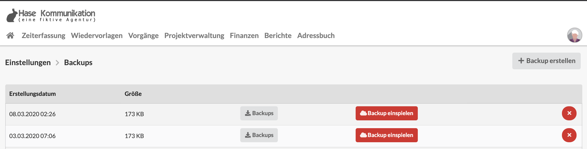

# Backups

Die Agenturverwaltungsdatenbank eures Unternehmens wird durch uns automatisch nächtlich an verschiedenen Standorten gesichert.

Wenn Du darüber hinaus selbst als Administrator eine Sicherungskopie erzeugen möchtest, kannst du hier manuell Backups anlegen, löschen und herunterladen.


**Hinweis zum Datenschutz**  
Solltest Du Backups auf einen Computer herunterladen, achte darauf die allgmeinen Datenschutzbestimmungen zu berücksichtigen. In dieser Backup-Datei befinden sich auch persönliche Informationen, z.B. Kunden-Adressen. Stelle sicher, dass nur befugte Personen Zugriff zu dieser Datei haben.


