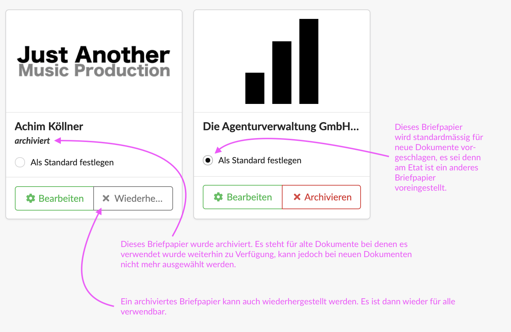

# Briefpapier

Die Agenturverwaltung unterstützt die Verwendung mehrere Briefpapiere. Was zu einem  Briefpapier gehört und wie es bearbeitet wird erfahrt ihr hier:


[briefpapier-anpassen.md](../../erste-schritte-1/grundeinstellungen/briefpapier-anpassen.md)


## Anwendungsbeispiele für Briefpapiere

#### Verschiedene Bankverbindungen oder Steuernummern

Ihr nutzt für alle Kunden ein bestimmtes Girokonto, ein bestimmter Kunde soll jedoch seinen Zahlungen an ein extra für ihn eingerichtetes Bankkonto leisten. Damit die richtige Bankverbindung in Rechnungen an diesen Kunden im Briefpapier angezeigt wird, kann für diesen Kunden ein eigenes Briefapier angelegt und im Etat als Standard definiert werden.

#### Untermarken eures Unternehmens

Ihr führt verschiedene Untermarken eures Unternehmens z.B. "Hase Kommunikation" und "Hase Media Production", je nach Auftrag könnt ihr hier das korrekte Briefpapier mit dem entsprechenden Unternehmenslogo nutzen.

#### Integrierte Werbebotschaften

Ihr legt 10 verschiedene Briefpapiere an, die alle einen unterschiedlichen kleinen Banner mit einer Werbebotschaft verfügen und rotiert diese nach dem Zufallsprinzip.

#### Verwendung von vorgedruckten Briefbögen

Wenn eure Agentur vorgedruckte Briefbögen aus der Druckerei verwenden möchte, könnt ihr ein zusätzliches Briefpapier anlegen, das kein Logo - und evtl. auch keinen Brieffuß - führt.

#### Mehrsprachiges Briefpapier

Wenn Euer Logo oder euer Brieffuß mehrsprachig verwendet wird, könnt ihr für jede Sprache ein entsprechendes Briefpapier anlegen. Ihr solltet das Briefpapier dann z.B. "Briefpapier PDF englisch" nennen. Wenn ihr dann ein englischsprachiges Finanzdokument anlegt, wählt ihr neben der Sprache (englisch) auch das englische Briefpapier aus.\
Diese Einstellungen könnt ihr auch am Etat unter "Einstellungen" vordefinieren, dann nuten alle Finanzdokumente dieses Etats die Sprache und das entsprechende Briefpapier.

### Arbeiten mit mehreren Briefpapieren

Ist mehr als ein Briefpapier vorhanden, kann eins der Briefpapiere als Standard-Briefpapier markiert werden. Es wird dann bei jedem neuen Dokument automatisch vorgeschlagen - es sei denn am Etat (im Reiter Einstellungen > Druckversion) ist etwas anderes definiert.

Ändert sich z.B. die Anschrift oder Rechtsform des Unternehmens, kann ein neues Briefpapier mit der neuen Anschrift erstellt werden. Das alte Briefpapier wird dann über die Schaltfläche "archivieren" deaktiviert. Es ist noch in Dokumenten, die es bisher genutzt haben verfügbar und stellt so deren Unveränderlichkeit sicher, wird jedoch bei neuen Dokumenten nicht mehr zur Auswahl angeboten.

