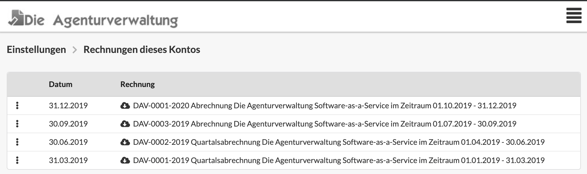

# Rechnungen für Die Agenturverwaltung

Hier findest du Rechnung für die Nutzung der Agenturverwaltung.

Die Agenturverwaltung ist ein Software-as-a-Service-Cloud-Dienst. Die Nutzung wird quartalsweise, rückwirkend und tagesgenau abgerechnet.

Die Preise hängen von der Anzahl der aktiven Nutzer des Systems ab und errechnen sich jeden Tag neu anhand der an diesem Tag höchsten Zahl an Nutzern.  
Wenn Du in den Einträgen links auf die drei Punkte klickst, entfaltet sich eine Liste mit den genauen Kosten je Tag.

`21.09.2019 30 aktive Benutzer im Account-Typ Small Enterprise (21 - 30 Benutzer, monatlich 279,00 € zzgl. 19% MwSt) 9,30 €   
20.09.2019 33 aktive Benutzer im Account-Typ Medium Enterprise (31 - 40 Benutzer, monatlich 349,00 € zzgl. 19% MwSt) 11,26 €  
19.09.2019 33 aktive Benutzer im Account-Typ Medium Enterprise (31 - 40 Benutzer, monatlich 349,00 € zzgl. 19% MwSt) 11,26 €`

