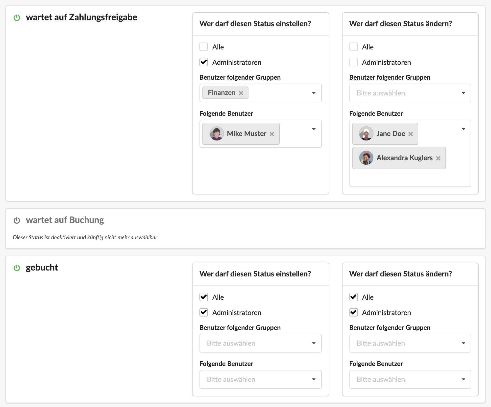

# Prozess-Konfigurator für Eingangsrechnungen

Unter Einstellungen > Prozessdefinitionen findet sich der Prozess-Konfigurator für Eingangsrechnungen.&#x20;

Hier kann definiert werden, welche Status-Schritte eine Eingangsrechnung durchläuft.

Verfügbar sind die folgenden Stati:

#### wartet auf Erfassung

Ein Beleg wurde z.B. bereits als Anhang hochgeladen, jedoch noch nicht weiter erfasst.

#### wartet auf Projektzuordnung

Dieser Beleg wurde erfasst und wartet darauf dass ein Projektmanager ihn als Fremdleistung auf ein oder mehrere Projekte bucht.\
Unter Umständen wurde der Projektmanager bereits per Wiedervorlage benachrichtigt.

#### wartet auf Zahlungsfreigabe (optional)

Dieser Beleg wartet darauf, dass eine zur Zahlungsfreigabe berechtigte Person, den Beleg zur Zahlung freigibt.

#### wartet auf Buchung  (optional)

Die Zuordnung des Belegs zu einem oder mehreren Projekten ist erfolgt. Je nach Konfiguration ist auch eine Zahlungsfreigabe erteilt worden. Der Beleg kann nun ggf. bezahlt werden und an ein Buchhaltungs-Drittsystem z.B. DATEV übergeben werden.

#### gebucht

Dieser Beleg wurde an die Buchhaltung übergeben.

#### reklamiert (optional)

Wird ein reklamierter Beleg nicht sofort gelöscht, kann dieser Status genutzt werden, um zu dokumentieren, dass dieser Beleg reklamiert wurde.

## Berechtigungen für die einzelnen Schritte definieren

Im Konfigurator kann definiert werden wer eine Eingangsrechnung überhaupt in einen bestimmten Status-Schritt überführen darf und wer den Status einer in einem bestimmten Status-Schritt befindliche Eingangsrechnung überhaupt ändern darf:

Optionale Status-Schritte (hier: wartet auf Buchung) können deaktiviert werden. Sie stehen dann künftig nicht mehr zur Verfügung.

### Anwendungsbeispiele für die Konfiguration von Berechtigungen

Belege, die auf "gebucht" stehen, wurden an die Steuerberatung übergeben, der Status sollte sich nur noch ändern dürfen, wenn eine bestimmte Person aus der Buchhaltung dies gestattet.

Nach der Projektzuordnung springt der Status um auf "Zahlungsfreigabe". In diesem Schritt dürfen nur 3 Personen den Status ändern, d.h. wenn der Status erreicht wurde, muss eine dieser 3 Personen die Zahlung freigeben indem sie die Rechnung auf den nächsten Schritt - z.B. "wartet auf Buchung" umstellt.

### Zahlungsfreigabe konfigurieren

Ist dieser Status aktiv und wird im Feld "Wer darf diesen Status ändern?" eine Gruppe von Personen angegeben, so kann beim Erfassen des Lieferantenbelegs ausgewählt werden, welche Person aus dieser Gruppe die Rechnung nach der Projektzuordnung zur Zahlung freigeben soll. Diese Person erhält dann eine [Wiedervorlage](../../wiedervorlagen-1/), sobald der Status der Rechnung auf "wartet auf Zahlungsfreigabe" umspringt.

