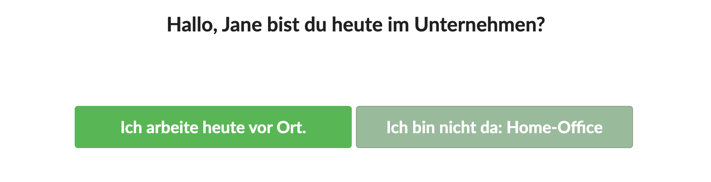

# Abwesenheitsassistent

Der Abwesenheitsassisten ist ein Dialog, der sich öffnet wenn eine NutzerIn an einem Tag das erste mal die Applikation öffnet.

Er fragt ab, ob die betreffende NutzerIn heute vor Ort im Unternehmen arbeitet oder für diesen Tag der hier konfigurierten Abwesenheitstyp zutrifft.

Diese Funktion eignet sich insbesondere für selbstverwaltende Teams und hilft dabei, ersichtlich zu machen, wer heute vor Ort ist, ohne dass eine Home-Office Liste durch die Teamleitung geführt werden muss.

Wählt eine NutzerIn hier "Ich bin nicht da" aus, wird die hier konfigurierte Abwesenheit "Home-Office" automatisch für heute eingetragen.

Ist die NutzerIn ohnehin Abwesend \(z.B. auf Fortbildung\), meldet sich jedoch am System an, entfällt die Abfrage.

