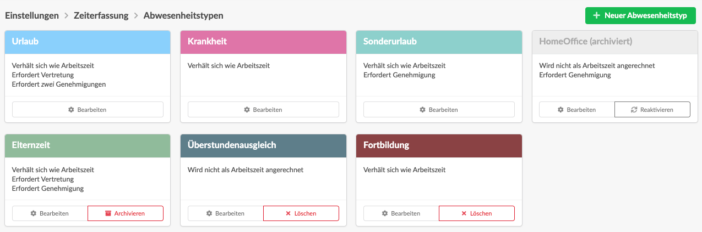
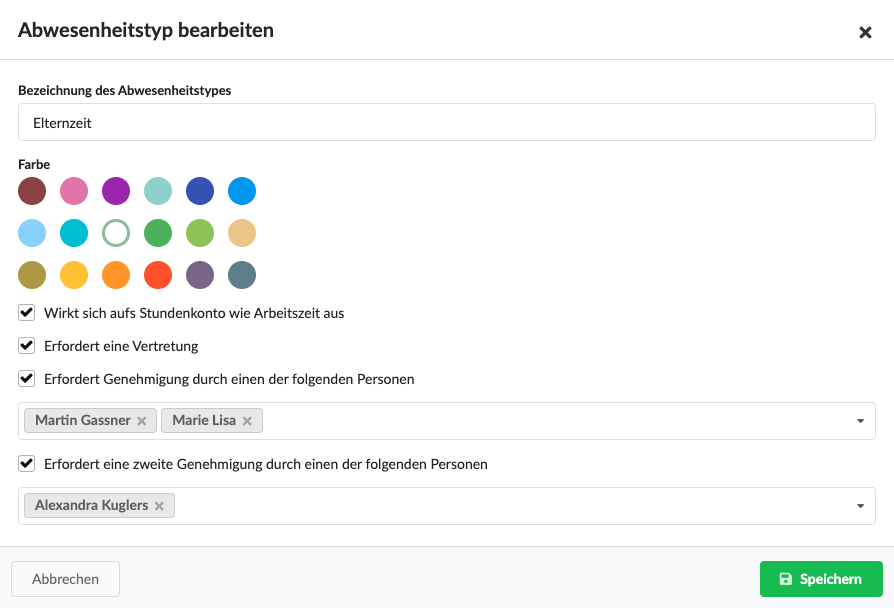

# Abwesenheitstypen



In diesem Video wird gezeigt wie man eigene Abwesenheitstypen erstellt und den Prozess von Vertretung und Genehmigung im Team konfiguriert.

## Die Liste der Abwesenheitstypen

Durch Klick auf "Bearbeiten" kann ein Abwesenheitstyp bearbeitet werden:

