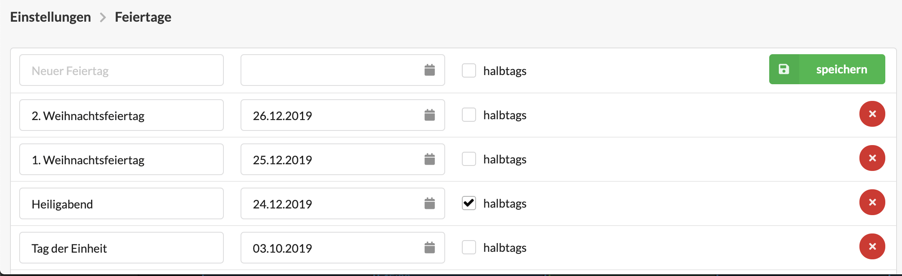

# Feiertage und Betriebsferien

In diesem Video wird gezeigt, wie Feiertage, Brückentage und Betriebsferien im Abwesenheitskalender und den Stundenkonten der Mitarbeiter konfiguriert werden können.



## Feiertage und Betriebsferien in der Agenturverwaltung

Feiertage und Betriebsferien sind Tage, an denen das Team nicht arbeitet, d.h. die regulär vereinbarte Arbeitszeit eines festangestellten Mitarbeiters an einem Feiertag ist null.

Mit der Konfiguration von Feiertagem und Betriebsferien werden daher Abweichungen zur der regulär vereinbarten Arbeitszeit je Wochentag eines Mitarbeiter vorgenommen.

Dies gilt nur für festangestellte Mitarbeiter mit einem hinterlegten Stundenkonto. Feiertage und Betriebsferien haben _keine_ Auswirkungen auf die Arbeitszeiten freiberuflicher Mitarbeiter, da für diese keine Soll-Arbeitszeiten konfiguriert werden.

## Konfiguration von Feiertagen und Betriebsferien

Die Liste der konfigurierten Feiertage und Betriebsferien kann durch berechtigte Benutzer in den Einstellungen unter Zeiterfassung &gt; Feiertage und Betriebsferien bearbeitet werden.  
 

Auf der Konfigurationsseite werden alle konfigurierten Feiertage und Betriebsferien aufgelistet.   
 

Bundesweite Feiertage sind bereits vorkonfiguriert, sie können nun um lokale Feiertage und ggf. Brückentage an denen die Agentur geschlossen ist \(Betriebsferien\) ergänzt werden. Über einen Klick auf den x-Button \(  \) können Feiertage und Betriebsferien entfernt werden. 

In der ersten Zeile kann ein neuer Feiertag hinzugefügt werden, indem zuerst eine Bezeichnung vergeben und das entsprechende Datum ausgewählt wird. Mit einem anschließenden Klick auf den Speichern-Button wird der Feiertag hinzugefügt.  

## Halbe Feiertage

Halbe Feiertage \(wie in diesem Beispiel "Heiligabend"\) können durch das Häkchen "halbtags" konfiguriert werden. Was das für den einzelnen Mitarbeiter bedeutet, hängt von seinem Arbeitsverhältnis ab. Ein Mitarbeiter der 8 Stunden an diesem Tag arbeitet, muss nur 4 Stunden arbeiten, ein Mitarbeiter der z.B. nur eine halbe Stelle besetzt, entsprechend nur 2 Stunden. Für Mitarbeiter die an diesem Wochentag frei haben, verhält sich dieser Feiertag rechnerisch neutral.

## Brückentage

Manche Agenturen schliessen, z.B. wenn zwischen einem Feiertag und dem Wochenende nur ein Tag liegt das Büro ganz. Dabei gibt es zwei mögliche Vereinbarungen:

#### a\) Arbeitnehmer müssen an diesen Tagen Urlaub nehmen

In diesem Fall darf der Brückentag nicht in der Liste der Feiertage mit aufgeführt sein, statt dessen wird - idalerweise gleich zu Jahresbeginn ein Urlaubstag an dem entsprechenden Tag für das ganze Team eingetragen.

#### b\) Diese Tage sind frei

Wenn an diesem Tag bei vollem Ausgleich nicht gearbeitet wird, kann er einfach wie ein Feiertag behandelt werden und in die Liste der Fei

