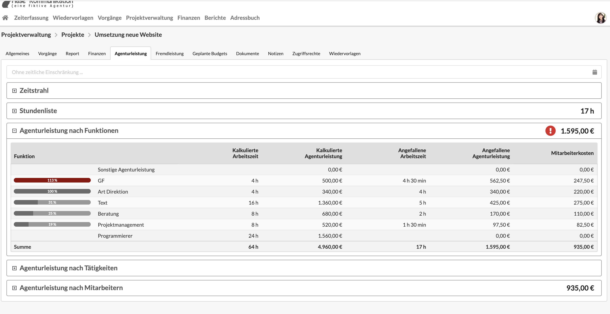

# Funktionen

Funktionen entsprechen den Gewerken - z.B. "Grafik Design", "Senior Beratung", "Programmierung" - mit denen die Agentur ihre Leistungen erbringt.

Sie sind ein zentrales Element der Agenturverwaltung, da sie sowohl die Grundlage zur Erstellung von Agenturleistungspositionen in Kostenvoranschlägen und Rechnungen darstellen als auch bei der Zeiterfassung essentiell sind.

### Funktionen für die Agentur definieren

Allgemeine Informationen zur Agenturpreisliste und zur Konfiguration der in eurer Agentur zur Verfügung stehenden Funktionen dieser findet ihr hier:



### Warum Funktionen?

Bei der Zeiterfassung spielen Funktionen eine wichtige Rolle, da in jedem Zeiterfassungseintrag eine Funktion ausgewählt werden muss. Die Funktion beschreibt dabei, in welcher Rolle - z.B. "Grafikdesig" - ein Mitarbeiter die gegenwärtige Aktivität ausgeübt hat. 

Die Auswahl der korrekten Funktion ist wichtig, da Funktionen die Basis für das Controlling der Agenturleistungen darstellen. So werden im Projekt-Controlling beispielsweise im Kostenvornaschlag kalkulierte Aufwände für eine Funktion den durch Projektmitarbeitern erfassten Aufwänden in dieser Funktion gegenüber gestellt.

So erkennen Projektleiter bereits früh in einem Projekt, ob wir ein Arbeitszeitbudget überzogen haben und wieviel Arbeitszeitbudget noch verfügbar ist.

### Mitarbeitern Funktionen zuweisen

In vielen Fällen stehen einem Mitarbeiter zwei oder mehr Funktionen zur Auswahl, sodass bspw. ein Creative Director je nach Art der Aufgabe zwischen unterschiedlich bepreisten Funktionen wie z.B. "Art Direktion", "Grafikdesign" auswählen kann. 

Einem Benutzer kann aber auch nur eine Funktion zugewiesen werden. Dann entfällt die Auswahl. Die Zuordnung von Funktionen zu Benutzern findet in den Benutzereinstellungen statt.



### Was kostet eine Stunde den Kunden?

Für den Kunden hängt der Stundensatz von dem im Etat des Kunden für die entsprechende Funktion definierten Wert ab.  
Der Preis für eine Stunde in der Funktion "Grafikdesign" unterscheidet sich dann unter Umständen vom Preis einer Stunde in der Funktion "Art Direction".

Hier wird erklärt wie die Etatpreisliste eines Kunden bearbeitet werden kann.



### Was kostet eine Stunde die Agentur?

Um die Kosten für die Agentur zu ermitteln, wird nicht der Stundensatz der Funktion sondern der sogenannte _Interne Mitarbeiterkostensatz_ des Nutzers, der die Stunde geleistet hat zugrunde gelegt.

Hier wird erklärt, wie dieser Preis sich zusammensetzt und wo man ihn einstellen kann.



