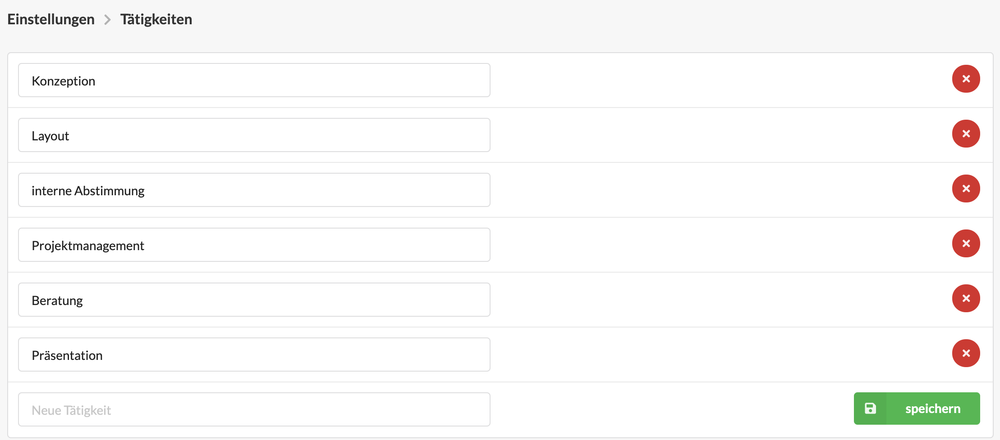

# Tätigkeiten

## Was sind Tätigkeiten und wie werden sie bei der Zeiterfassung ausgewählt?

Tätigkeiten sind kleine Textbausteine, die in der Zeiterfassung verwendet werden und sich häufig wiederholende Aktivitäten bezeichnen.   
Beispiele sind "Telefonat Kunde" oder "Reinzeichnung". 

Sie können vom  Benutzer beim Anlegen eines Zeiterfassungseintrags  ausgewählt werden. Der Benutzer kann darüberhinaus weiterhin manuell Notizen zu seinem Eintrag ergänzen. Statistisch kann Arbeitszeit, die mit einer  Tätigkeit assoziiert wurde im Kunden, Etat und Projekt kummuliert ausgewertet werden. Damit können sich Fragen wie "Wieviel Stunden sind in diesem Projekt für _Layouterstellung_ angefallen?" beantwortet werden.


**Zwei Anwendungsszenarien für Tätigkeiten**  
Mit einer Tätigkeit "_Meeting_" könnte erfasst werden wieviel Zeit bei einem bestimmten Kunden auf Meetings entfällt.  
  
Mit Tätigkeiten wie "_Korrekturphase_ I" und "_Korrekturphase_ II" könnte erfasst werden, wie viel Arbeitszeit bei einem Projekt oder auch generell bei einem Kunden für Autorenkorrekturen anfällt.


Eine Tätigkeit ist ein optionaler Teil eines Zeiterfassungseintrags. Die Zeiterfassung kann auch vollständig ohne Tätigkeiten erfolgen. 

Wurden in der Tätigkeitsliste für den zeiterfassenden Nutzer gar keine Tätigkeiten definiert, wird das Auswahlfeld "Tätigkeit" im Zeiterfassungsdialog ausgeblendet.

## Konfiguration von Tätigkeiten

Die Liste der auswählbaren Tätigkeiten kann durch berechtigte Benutzer in den Einstellungen unter Zeiterfassung &gt; Tätigkeiten bearbeitet werden.  

Auf der Konfigurationsseite werden alle verfügbaren Tätigkeiten aufgelistet.  
 

Über einen Klick auf den x-Button \(  \) können Tätigkeiten entfernt werden.   
Wurden diesen aber in vorhergehenden Zeiterfassungseinträgen genutzt, bleiben alte Zeiterfassungseinträge davon unberührt. 

In der letzten Zeile kann eine neue Tätigkeit hinzugefügt werden, indem zuerst eine Bezeichnung vergeben und anschließend der Speichern-Button geklickt wird.  
 


**Hinweis**: Neu hinzugefügte Tätigkeiten müssen auch den entsprechenden Nutzern hinzugefügt werden, sie stehen ihnen sonst nicht in der Zeiterfassung zur Verfügung.


