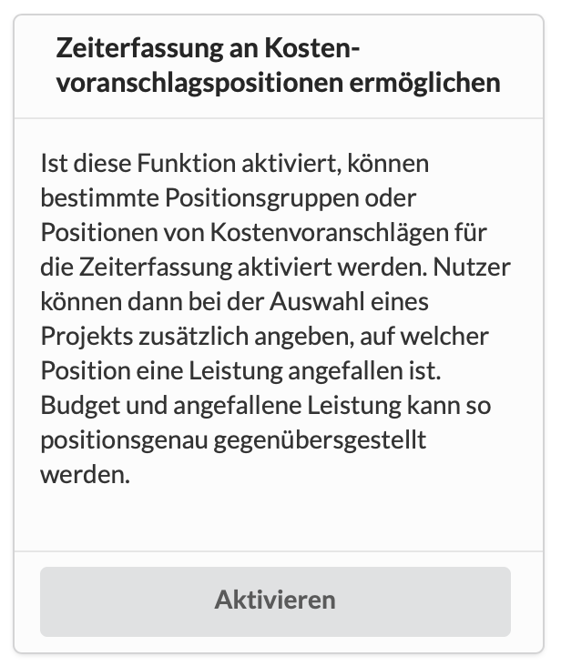

# Zeiterfassung an Positionen von Kostenvoranschlägen

In einem grösseren Projekt kann es Sinn machen, Zeiten nicht nur generell auf das Projekt zu erfassen, sondern sie gegen die in unserem Kostenvoranschlag beschriebenen Angebotspositionen laufen zu lassen.

Ist diese Funktion aktiviert, kann direkt an einer Position oder Positionsgruppe eingestellt werden, ob sie für die Zeiterfassung zur Verfügung stehen soll.

In den Einstellungen eines Projekts lassen sich in der Rubrik "Zeiterfassung" auch alle Kostenvoranschlagspositionen eines Projekts auf einen Blick für die Zeiterfassung konfigurieren - auch wenn es im Projekt mehrere Kostenvoranschläge gibt.

Wie das geht und weitere Details dazu findest du hier:





