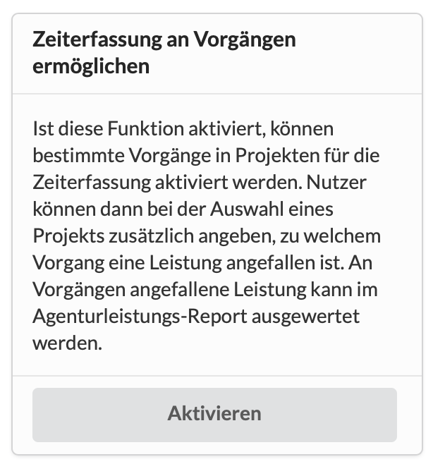

# Zeiterfassung an Vorgängen

In einem grösseren Projekt kann es Sinn machen, Zeiten nicht nur generell auf das Projekt zu erfassen, sondern Vorgänge anzulegen, die Teilabschnitte, Milestones oder konkrete Aufgaben in diesem Projekt repräsentieren.

So lässt sich nicht nur auswerten, wieviel Arbeitszeit im gesamten Projekt angefallen ist, sondern auch auf welchen Abschnitten des Projekts. Dadurch ergibt sich ein wesentlich transparenteres Bild.

In den Einstellungen kann generell die Möglichkeit geschaffen werden diese Option zu aktivieren.

Dadurch erscheint an jedem Vorgang eine Checkbox "Diesen Vorgang in der Zeiterfassung zur Verfügung stellen". Das bedeutet, du kannst auch nur bestimmte Vorgänge für die Zeiterfassung aktivieren.

Wie das geht, erfährst Du [hier](https://wiki.dieagenturverwaltung.de/zeiterfassung-1/zeiterfassung-an-milestones-von-projekten#zeiterfassung-an-vorgaengen).

