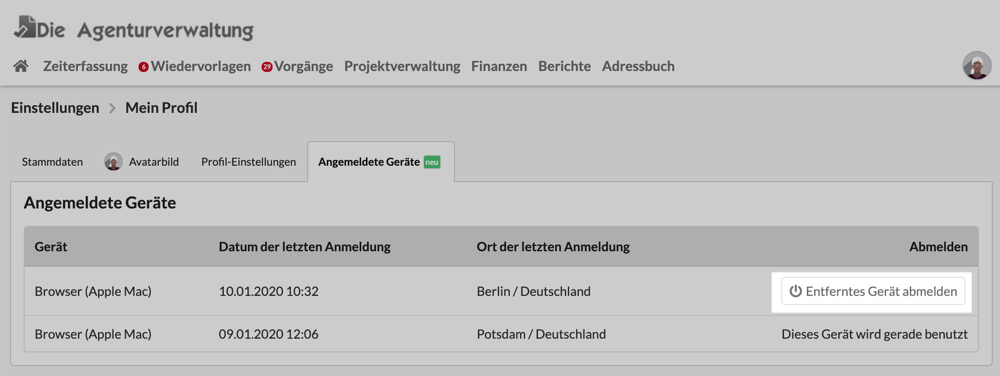

# Anmelden und Abmelden

## Anmeldung mit E-Mail-Adresse und Passwort

Die Anmeldung am System erfolgt mit E-Mail-Adresse und Passwort.

Die URL unter die sich Nutzer anmelden und unter der Die Agenturverwaltung für dein Unternehmen zur Verfügung steht folgt diesem Schema

> https://_unternehmensname_.dieagenturverwaltung.de

## Abmeldung (Logout)

Im Einstellungsmenü rechts oben auf der Seite  (es wird sichtbar wenn du darauf klickst) befindet sich eine Schaltfläche "abmelden". Diese Schaltfläche zeigt einerseits an, wer gerade angemeldet ist (indem dein Name dort steht), andererseits führt ein Klick darauf dazu dass dieser Browser abgemeldet wird.

### Abmeldung von entfernten Geräten

Wenn Du dich beispielsweise gestern in einem Internetcafé auf einem öffentlichen Browser angemeldet  und vergessen hast, dich wieder abzumelden, kannst Du das in deinem Profil tun.

Dazu klickst du wieder auf das Einstellungsmenü (oben rechts) und dann auf "Einstellungen". Im nächsten Schritt klickst Du auf die Kachel "Mein Profil". Dort öffnest du den Reiter "Angemeldete Geräte". Hier kannst Du dich mit einem Klick von dem (entfernten) Gerät abmelden, in diesem Beispiel vom entfernten Rechner eines Internetcafés in Berlin.

## Passwort setzen

#### Passwort-vergessen Funktion nutzen

Das Login-Formular verweist unten auf eine Passwort-vergessen Funktion. Hast du dein Passwort vergessen, kannst du diesem Link folgen. Du gibst anschliessend die E-Mail-Adresse an, die für dich in der Agenturverwaltung gespeichert ist.\
Unser System sendet dir anschliessend an dieses E-Mail-Konto einen Link. Öffne den Link und vergibt dir ein neues Passwort.

#### Eigenes Passwort neu setzen

Wenn Du bereits angemeldet bist und dein Passwort neu setzen möchtest, kannst Du das in deinen Profileinstellungen machen:


[mein-profil.md](../einstellungen-1/benutzerverwaltung/mein-profil.md)


#### Passwort-Reset-E-Mail an andere Benutzer senden

Wenn du Zugriff auf die Benutzerverwaltung hast, kannst du auch anderen Benutzern eine E-Mail mit einem Link zusenden. Dieser Link führt den Nutzer zu einer Seite auf der er sich ein neues Passwort vergeben kann.

#### Neuen Benutzer einladen sein Passwort selbst zu erstellen

Hat ein neu angelegter Nutzer bisher noch gar kein Passwort so kannst du ihm eine Einladungs-E-Mail senden. Diese E-Mail enthält einen Link zu einer Seite auf der der neue Nutzer sein initiales Passwort einstellen kann.

## Wissenswertes zu Passwörtern

* Das Passwort sollte lang sein, mind. 10-15 Zeichen.
* Das Passwort sollte nirgendwo im Klartext notiert werden.
* Das Passwort sollte niemand anderem als dem Nutzer bekannt sein.
* Das Passwort sollte neben Buchstaben auch Zahlen und Sonderzeichen enthalten.
* Für jede Applikation sollte ein eigenes Passwort verwendet werden. **Auf keinen Fall sollte das Passwort für Die Agenturverwaltung auch z.B. für Banking, Social Media Accounts oder E-Mail-Postfächer verwendet werden!**
* Wie empfehlen Passwörter in einem geeigneten, verschlüsselten Passwort-Safe z.B. [1Password](https://1password.com/de/) zu organisieren.
* Das Passwort sollte gelegentlich - z.B. alle paar Wochen oder nach Aufforderung durch den Systemadministrator - geändert werden. Die Agenturverwaltung weist dich gelegentlich darauf hin.


Passwörter werden  in unserer Datenbank destruktiv verschlüsselt gespeichert. Selbst unser Kundenservice kann diese Passwörter nicht mehr einsehen oder entschlüsseln.

**Unser Kundenservice wird nie von dir verlangen dein Passwort zu nennen!** \
**Bitte sende keine Passwörter per E-Mail an uns.**


## **Ich kann mich nicht anmelden**

Sollte das System deine Anmeldung verweigern, wird dir eine Fehlermeldung angezeigt:

#### Dieser Nutzer ist nicht bekannt

* Hast Du dich bei der URL vertippt?
* Ist dein Benutzer gesperrt worden?
* Ist dein Benutzer gelöscht oder noch nicht angelegt worden?

#### Der Zugang für diesen Account temporär deaktivert

Der kostenlose Testzeitraum für Die Agenturverwaltung ist abgelaufen.\
Sprich den Kundenservice an: [info@dieagenturverwaltung.de](mailto:info@dieagenturverwaltung.de)

#### Bitte gib deine Emailadresse und dein Passwort an

Du hast kein Passwort angegeben.

#### Die Zugangsdaten wurden vom System nicht akzeptiert

Möglicherweise hast Du das falsche Passwort angegeben oder eine E-Mail-Adresse die nicht im System hinterlegt war?

#### Deine IP-Adresse wurde wegen zu vielen Fehlversuchen vorübergehend gesperrt

Solltest Du diese Meldung sehen ohne dass du beim Anmelden mehrere Fehlversuche hattest, wende dich an den Kundenservice: [info@dieagenturverwaltung.de](mailto:info@dieagenturverwaltung.de)

## Ich kann mich anmelden, sehe aber keine Menüpunkte

Möglicherweise wurden dir noch keine Berechtigungen erteilt. Sprich einen Administrator an.
