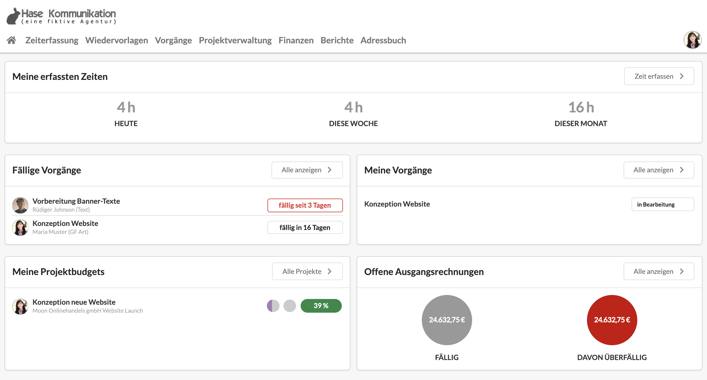
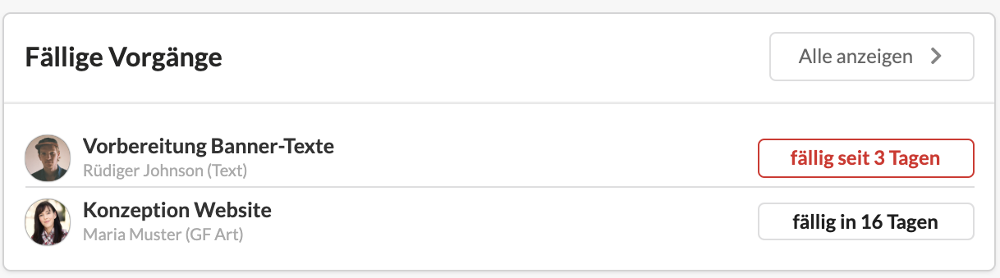
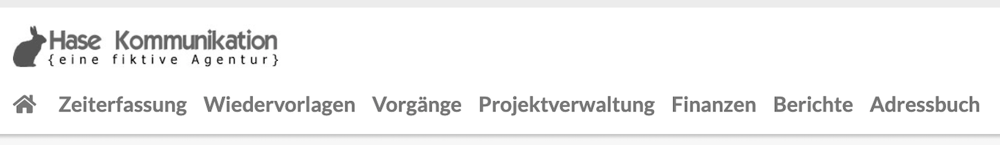

# Einstieg für Projektmanager

Herzlich Willkommen in unserem kurzen Einführungskurs zur Nutzung der Agenturverwaltung für Projektmanager. Dieser Kurs richtet sich an Nutzer, welche in ihrem Arbeitsalltag vor allem das Finanz- und Projektmanagement der Agenturverwaltung verwenden. Auf dieser Seite findet ihr Informationen und Verlinkungen zu folgenden Themengebieten:

* Einführung in die Agenturverwaltung: die wichtigsten Begriffe
* Erstellung von Kostenvoranschlägen
* Projektverwaltung
* Zeiterfassung
* Vorgänge im Rahmen von Projekten
* Wiedervorlagen
* Reporting
* ...

Unsere digitalen Kurse sind kurz und knapp gehalten, um dich nicht unnötig zu langweilen. Sollten Fragen unbeantwortet bleiben, wende dich an den Agenturverwaltungs-Ansprechpartner in deinem Unternehmen oder an unseren Support, welchen du direkt aus der Agenturverwaltungssoftware erreichst.


[anfrage-an-den-kundenservice-stellen.md](anfrage-an-den-kundenservice-stellen.md)


## Inhalte

Die Startseite // Dein Dashboard

Die wichtigsten Begriffe // Ganz wenig Theorie vorweg

Angebote erstellen //  Kostenvoranschläge im Bereich Finanzen

Operative Arbeit organisieren // Die Projektverwaltung

Zeiterfassung // 3 Wege, um deine Arbeitszeit zu erfassen

Vorgänge // Aufgaben und Zusammenarbeit in Projekten

Wiedervorlage // Benachrichtigungen und Erinnerungen für dich und deine Kollegen

Projekterfolg sichern // Reports im Rahmen von Projekten

## Die Startseite // Dein Dashboard

Deine Startseite ist üblicherweise das Dashboard, in welchem dir für dich relevante Informationen dargestellt werden.\
&#x20;&#x20;

Als Projektmanager kannst du dir hier einen schnellen Überblick über deine relevanten Vorgänge, KVAs und Budgets verschaffen. \
Es gibt bspw. Dashboard-Boxen zu den folgenden Themen:

* Fällige Vorgänge (die du beobachtest oder die dir zugewiesen sind)
* Meine Vorgänge
* Meine Projekte
* Meine auf Freigabe wartenden Kostenvoranschläge&#x20;
* Meine Projektbudgets&#x20;
* Unbezahlte Ausgangsrechnungen

&#x20;Mit einem Klick auf den Button "Alle anzeigen" in einer Box kannst du zu einer Detailseite navigieren.&#x20;

Ansonsten erfolgt die Navigation innerhalb der Agenturverwaltung über das Menu unterhalb eures Logos. \
&#x20;&#x20;

_Übrigens: Nicht alle Benutzer der Agenturverwaltung sehen die gleichen Menu-Punkte. Der Administrator kann einzelne Bereiche für Benutzer oder Benutzergruppen de-/aktivieren wenn sie von den jeweiligen Nutzern nicht benötigt werden._

### Die wichtigsten Begriffe // Ganz wenig Theorie vorweg

Damit wir auf den folgenden Seiten nicht aneinander vorbeireden, findest du auf der verlinkten Seite eine kurze Definition der wichtigsten Begriffe in der Agenturverwaltung: Budget, Umsatz, Agentur- und Fremdleistung.


[die-kennzahlen.md](../projektverwaltung-1/die-kennzahlen.md)


### Angebote erstellen //  Kostenvoranschläge in Bereich Finanzen

todo

### Operative Arbeit organisieren // Die Projektverwaltung

Die Projektverwaltung ist die operative Schaltzentrale der Agenturverwaltung. In der Projektverwaltung findet sowohl die Planung, als auch die Erfassung von Agentur- und Fremdleistungen sowie die Abrechnung statt.

Eine Einführung in die Projektverwaltung findest du auf der Seite Projektverwaltung und auf den Unterseiten des Bereichs.


[projektverwaltung-1](../projektverwaltung-1/)


Eine Übersicht über beispielhafte Projektabläufe und deren Abbildung in der Agenturverwaltung findest du bald hier.

### Zeiterfassung // 3 Wege, um die eigene Arbeitszeit zu erfassen

Die Agenturverwaltung unterstützt drei Arten, Arbeitszeit zu erfassen:&#x20;

* **Timer:** Für Mitarbeiter, die viel zwischen Aufgaben hin und her springen und über den Tag verteilt an verschiedenen Projekte arbeiten.&#x20;
* **Wochenansicht **Für Mitarbeiter, die ihre Zeiten lieber am Ende einer Woche auf einmal erfassen möchten&#x20;
* **Klassische Liste:** Der Klassiker für alle, die ihre Arbeitszeitblöcke in einer Liste organisieren möchten

Detaillierte Informationen zum Thema Zeiterfassung im Allgemeinen und zur Verwendung der Zeiterfassung in der Agenturverwaltung findest du hier:


[zeiterfassung-1](../zeiterfassung-1/)


### Vorgänge // Aufgaben und Zusammenarbeit in Projekten

Vorgänge sind Aufgaben, die mit Deadlines und Kommentaren versehen werden können. Sie können sowohl für die **Organisation des eigenen Arbeitstages** als auch in Projekten zur **Organisation eines Teams **verwendet werden.&#x20;

Detaillierte Informationen zum Thema Vorgänge findest du hier:


[vorgaenge-1](../vorgaenge-1/)


### Wiedervorlage // Erinnerungen für dich und deine Kollegen

Wiedervorlagen sind ein wichtiges Werkzeug, um im Agenturalltag den Überblick zu behalten.\
In der Agenturverwaltung erfüllen Wiedervorlagen den Zweck einer Erinnerungen für einen Benutzer. Sie können mit verschiedenen Entitäten, z.B. Projekten, Kostenvoranschlägen, Kontakten oder Rechnungen verknüpft sein und helfen dabei, ereignisgetriebene Prozesse zu etablieren.

Detaillierte Informationen zum Thema Wiedervorlagen  findest du hier:


[wiedervorlagen-1](../wiedervorlagen-1/)

