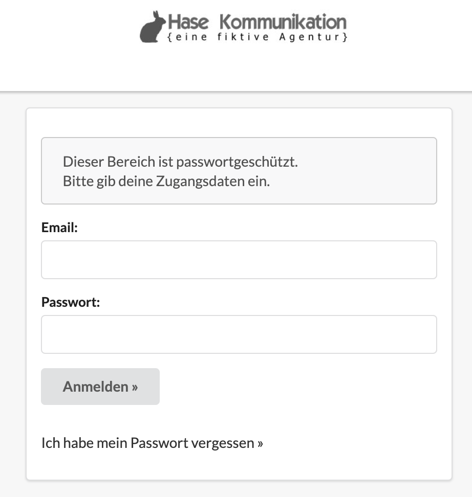

# Einstieg für Projektmitarbeiter

Herzlich Willkommen in unserem kurzen Einführungskurs zur Nutzung der Agenturverwaltung für Projektmitarbeiter. Dieser Kurs richtet sich an Nutzer, welche für ihre tägliche Arbeit lediglich eine oder mehrere der nachfolgenden Funktionen verwenden: 

* Dashboard
* Zeiterfassung
* Vorgänge im Rahmen von Projekten
* Wiedervorlagen

Unsere digitalen Kurse sind kurz und knapp gehalten, um dich nicht unnötig zu langweilen. Sollten Fragen unbeantwortet bleiben, wende dich an den Agenturverwaltungs-Ansprechpartner in deinem Unternehmen oder an unseren Support, welchen du direkt aus der Agenturverwaltungssoftware erreichst.



## Inhalte

Registrierung // Setze Dein Passwort 

Anmeldung // So erlangst Du Zugang zu deinen Daten

Die Startseite // Dein Dashboard

Zeiterfassung // 3 Wege, um deine Arbeitszeit zu erfassen

Vorgänge // Aufgaben und Zusammenarbeit in Projekten

Wiedervorlage // Benachrichtigungen und Erinnerungen für dich und deine Kollegen

## 

## 

## Registrierung & Anmeldung

### Registrierung

Um auf die Agenturverwaltung zugreifen zu können, benötigst du im ersten Schritt Zugangsdaten. Deinen Benutzername - er entspricht der E-Mail-Adresse die der Administrator der dich eingeladen hat in der Agenturverwaltung eingetragen hat - erhältst du in der Einladungs-Email, welche der Administrator deines Unternehmens an dich versendet. Solltest du noch keine Einladungs-Email erhalten haben, wende dich bitte zuerst an den Agenturverwaltungsadministrator deines Unternehmens. In der Einladungs-Email erhältst du einen Link, über den du dein persönliches Passwort festlegen kannst. Ist das getan, kannst du dich mit deinem Benutzernamen und Passwort an der Agenturverwaltung anmelden.

_Übrigens: Wissenswertes zum Thema Passwort findest du hier:_ [_Anmelden und Abmelden_](am-system-anmelden.md#wissenswertes-zu-passwoertern)\_\_

### Anmeldung

In der Einladungs-Email zur Registrierung wird dir auch die Website-Adresse zur Agenturverwaltung mitgeteilt. Da jeder unserer Kunden eine eigene Instanz der Agenturverwaltung erhält, gibt es keine einheitliche Website-Adresse. Dein Agenturverwaltungsadministrator wird dir eure spezifische Adresse nach dem Muster `https://<euerAgenturname>.dieagenturverwaltung.de/`   
mitteilen.  
  

Auf der Anmelde-Seite kannst du dich dann mit deiner E-Mail-Adresse und deinem Passwort anmelden.

### Die Startseite // Dein Dashboard

Deine Startseite ist üblicherweise das Dashboard, in welchem dir für dich relevante Informationen dargestellt werden.  
  

Als Projektmitarbeiter sind für dich wahrscheinlich vor allem die Box zur Zeiterfassung und die Box mit den fälligen, dir zugewiesenen Vorgängen nützlich. Mit einem Klick auf den Button oben rechts "Alle anzeigen" kannst du zu einer Detailseite navigieren.   
  

Ansonsten erfolgt die Navigation innerhalb der Agenturverwaltung über das Menu unterhalb eures Logos.   
  

_Übrigens: Nicht alle Benutzer der Agenturverwaltung sehen die gleichen Menu-Punkte. Der Administrator kann einzelne Bereiche für Benutzer oder Benutzergruppen de-/aktivieren wenn sie von den jeweiligen Nutzern nicht benötigt werden._

### Zeiterfassung // 3 Wege, um die eigene Arbeitszeit zum tracken

Die Agenturverwaltung unterstützt drei Arten, Arbeitszeit zu erfassen: 

* **Timer:** Für Mitarbeiter, die viel zwischen Aufgaben hin und her springen und über den Tag verteilt an verschiedenen Projekte arbeiten. 
* **Wochenansicht** Für Mitarbeiter, die ihre Zeiten lieber am Ende einer Woche auf einmal erfassen möchten 
* **Klassische Liste:** Der Klassiker für alle, die ihre Arbeitszeitblöcke in einer Liste organisieren möchten

Detaillierte Informationen zum Thema Zeiterfassung im Allgemeinen und zur Verwendung der Werkzeuge in der Agenturverwaltung findest du hier:



### Vorgängen im Rahmen von Projekten

_Hier findest du bald Informationen zur Verwendung von Vorgängen._

### Wiedervorlage // Erinnerungen für dich und deine Kollegen

_Hier findest du bald Informationen zur Verwendung von Wiedervorlagen._

