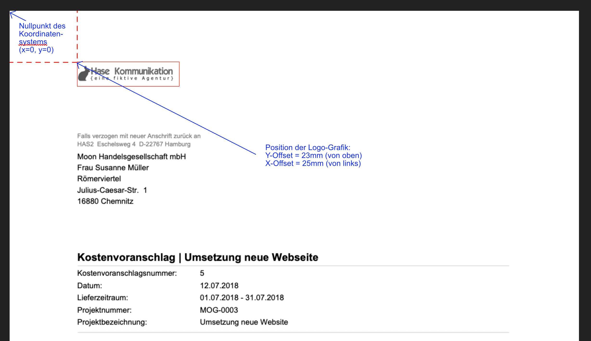

# Briefpapier anpassen

## Logo hochladen

Das Bild muss mit ausreichender Auflösung zur Verfügung stehen damit es nicht unscharf beim Drucken wird. z:b. 800x800 Pixel. Sehr große Dateien erzeugen auch große PDF-Rechnungsdokumente da die Grafik Teil jedes Dokuments ist das aus der Agenturverwaltung erstellt wird. D.h. Dokumente werden auch beim E-Mail-Versand entsprechend grösser. Empfohlen werden PNG- oder JPEG-Dateien mit einer Grösse von 30-60KB.

Das Logo sollte keinen Rand haben. Position und Grösse des Logos können über die Felder Höhe \(in Milimetern\) sowie den X- und Y-Offset \(der Nullpunkt des Koordinatensystems ist dabei links oben auf der DIN A4 Seite\) jeweils einzeln für das Hoch- sowie das Querformat \(A4\) eingestellt werden.

Alle Abmessungen im Briefpapier werden in Milimeter angegeben. Hat die Logo-Grafik einen Rand, muss dieser bei der Positionierung ggf. berücksichtigt werden.

Analog dazu können die Positionen des Brieffußes und der Seitenzahlen angepasst werden.

Das Seitenformat für Briefpapier ist DIN A4 - daraus ergibt sich eine Breite von 210mm und eine Höhe von 297mm.

> **Hinweis**: Damit Dokumente auch von einfacheren Druckern \(z.B. bei euren Kunden\) ausgedruckt werden können sollten sie einen Seitenrand von 15 - 20mm vorsehen. Elemente die ausserhalb dieser Zone liegen sind zwar im PDF sichtbar, werdem beim Ausdruck aber ggf. angeschnitten.


**Benötigst du Hilfe beim Layout?**  
  
Es gibt noch viele weitere Möglichkeiten, z.B. Logos im Brieffuß, Logo nur auf der ersten Seite, mehrere Logos, randlose Vollflächige Hintergrundgrafiken, Spalten oder bündige Textausrichtung im Brieffuß usw. diese Einstellungen sind nicht alle über die Benutzeroberfläche zugänglich.  
  
Sprecht dazu gerne unseren [Kundenservice](mailto:info@dieagenturverwaltung.de) an.


## Wichtige Informationen im Brieffuß

Der § 14 des Umsatzsteuergesetz legt gesetzlich fest, was auf jeder Rechnung stehen muss. 

Dort ist u.a. vermerkt, dass deutlich erkennbar sein sollte, wer wem eine Rechnung stellt. Die vollständige Anschrift des Leistungsempfängers wird aus den Kundenstammdaten ausgelesen und automatisiert auf Höhe des Brieffensters positioniert. 

Im Briefpapier hinterlegen müsst ihr allerdings die vollständige Adresse des Leistungserbringers, also eurer Agentur. Auch eure Bankverbindung sollte sich im Brieffuß befinden, sodass eure Kunden die Rechnungen auch begleichen können.

## **Diese Informationen gehören in den Brieffuß**

#### **Auf einen Blick**

* Name und Rechtsform eurer Agentur
* die vollständige Postanschrift
* die Steuernummer und der Sitz den Finanzamts
* die Umsatzsteuer-Identifikationsnummer, kurz USt-IdNr., solltet ihr Rechnungen ins europäische Ausland stellen
* eine Bankverbindung, damit Kunden Eure Rechnungen auch begleichen können

Abhängig von eurer Rechtsform, müssen noch weitere  Informationen im Brieffuß ergänzt werden.  
Bei der Rechtsform GmbH oder GmbH & Co KG ist dies beispielsweise:

* die Handelsregisternummer
* der Gerichtsstand
* Namen des Geschäftsführers \(oder der Geschäftsführer\)

Wenn ihr unsicher seid: Euer Steuerberater kann hier auch weiterhelfen.


**Beispiel für einen vollständigen Brieffuß:**  
Muster Werbeagentur GmbH Wiesendamm 3 20000 Hamburg   
Tel.: 040 - 41 1111-0 Fax.: 040 - 41 1111-99  
info@wagner-werbeagentur.de www.muster-werbeagentur.de  
Geschäftsführer: Max Muster Registergericht Hamburg, HRB: HH 123412  
USt-Id Nr.: DE1234123412 Finanzamt Hamburg  
IBAN DE20 1234 1234 1234 1234 12 BIC ABCDEFGXXX Mustersparkasse 


## Mehrspaltiger Brieffuß

Mit einem kleinen Trick ist es möglich den Brieffuss in zwei oder drei Spalten laufen zu lassen. Trennt im Textfeld die Spalten mit dem Raute-Zeichen `#` voneinander:


In diesem Beispiel landen alle Inhalte nach der Raute \(\#\) in der zweiten Spalte:  
`Muster Werbeagentur GmbH  
Wiesendamm 3 20000 Hamburg   
Tel.: 040 - 41 1111-0   
info@wagner-werbeagentur.de  
www.muster-werbeagentur.de#Geschäftsführer: Max Muster  
Registergericht Hamburg, HRB: HH 123412  
USt-Id Nr.: DE1234123412Finanzamt Hamburg  
IBAN DE20 1234 1234 1234 1234 12  
BIC ABCDEFGXXX Mustersparkasse` 


So sieht die Aufteilung dann im Brieffuß aus:

| Linke Spalte | Recht Spalte |
| :--- | :--- |
| Muster Werbeagentur GmbH Wiesendamm 3 20000 Hamburg  Tel.: 040 - 41 1111-0  info@wagner-werbeagentur.de www.muster-werbeagentur.de | Geschäftsführer: Max Muster Registergericht Hamburg, HRB: HH 123412 USt-Id Nr.: DE1234123412 Finanzamt Hamburg IBAN DE20 1234 1234 1234 1234 12 BIC ABCDEFGXXX Mustersparkasse |

