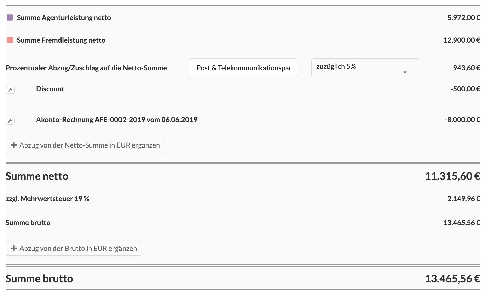

# Der Summenblock am Ende des Dokuments

Unterhalb der Positionsliste befinden sich eine Sektion mit den Summen des Dokuments.

#### Agentur- und Fremdleistung

Hier werden die Agentur- und Fremdleistungsanteile aller aufgeführten Positionen aufaddiert.

#### Prozentuale Abzüge und Zuschläge

Mit diesem Auswahlfeld und der dazugehörigen Beschreibung können Prozentuale Abzüge und Zuschläge auf die Nettosumme des Dokuments erzeugt werden.  
Ein Zuschlag kann z.B. für "Markup" oder "Bearbeitungsgebühr", ein Abzug für "Rabatt" verwendet werden.


**Prozentuale Abzüge und Zuschläge** sowie **Netto-Abzüge** verhalten sich leistungsneutral, d.h. sie sind weder der Agentur- noch der Fremdleistung zugehörig. Dadurch kann sich also das Projektgesamtbudget ändern, das Budget für Agentur- oder Fremdleistung bleibt davon jedoch unberührt. Im Zweifelsfall macht es in so einem Fall Sinn, Agentur- und Fremdleistungsbudgets im Projekt als Geplante Budgets zu definieren und nur beim Gesamtbudget bezug auf den Kostenvoranschlag zu nehmen.


#### Netto-Abzüge

Ein Nettoabzug besteht aus einer Bezeichnung \(z.B. "Preisminderung wegen verspäteter LIeferung"\) und einem Betrag. Der Betrag wird von der Netto-Summe abgezogen.  
Es können mehrere Netto-Abzüge erstellt werden. Wird hier ein negativer Betrag angegeben kann ein Netto-Abzug sogar als Netto-Zuschlag verwendet werden.

Bei der Schlussrechnung eines Kostenvoranschlags, aus dem zuvor bereits Akonto-Rechnungen abgerechnet wurden, werden auomatisch die Netto-Abzüge für jede Akonto-Rechnung erzeugt.

In unserem Beispiel wurden in einer Akonto-Rechnung vom 06.06.2019 bereits 8000 EUR netto abgerechnet. Sie werden daher hier abgezogen. Dieser Eintrag wird bei der Schlussrechnung automatisch erzeugt, kann aber auch geändert werden.

#### Netto-Summe

Die Netto-Summe kumuliert noch einmal alle Beträge.

#### Mehrwertsteueranteil und -satz

Ist das Dokument eine Ausgangsrechnung oder Gutschrift, so kann hier die Mehrwertsteuer eingestellt werden.  
Die Voreinstellungen beziehen sich auf den deutschen Markt, sollte dein Unternehmen z.B. in Österreich sitzen, lass uns das wissen, wir konfigurieren dann die entsprechenden Mehrwertsteuersätze für dich.   
Den Kundenservice erreichst du hier: info@dieagenturverwaltung.de

#### Brutto Abzüge

Es ist möglich einen oder mehrere Brutto-Abzüge zu definieren, sie verhalten sich wie Netto-Abzüge, allerdings beziehen sie sich auf die Netto-Summe zzgl. Mehrwertsteuer.

#### Brutto-Summe

Die Brutto-Summe addiert die Netto-Summe, die Mehrwertsteuer und subtrahiert ggf. Brutto-Abzüge.

