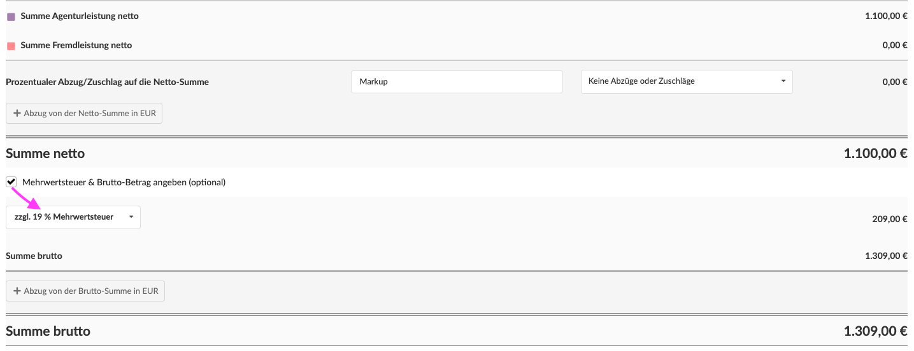
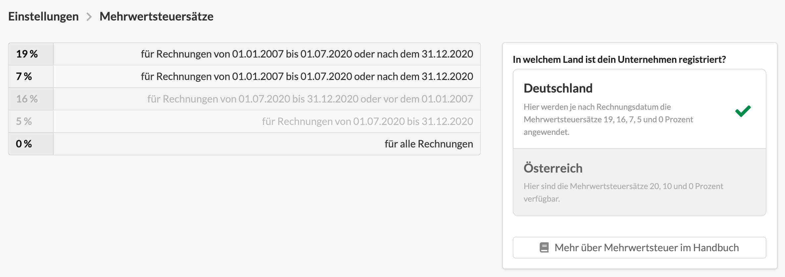

# Umsatzsteuer, Rabatte, Gesamtsummen

Unterhalb der Positionsliste befinden sich eine Sektion mit den Summen des Dokuments.

#### Agentur- und Fremdleistung

Hier werden die Agentur- und Fremdleistungsanteile aller aufgeführten Positionen aufaddiert.

#### Prozentuale Abzüge und Zuschläge

Mit diesem Auswahlfeld und der dazugehörigen Beschreibung können Prozentuale Abzüge und Zuschläge auf die Nettosumme des Dokuments erzeugt werden.\
Ein Zuschlag kann z.B. für "Markup" oder "Bearbeitungsgebühr", ein Abzug für "Rabatt" verwendet werden.


**Prozentuale Abzüge und Zuschläge** sowie **Netto-Abzüge** verhalten sich leistungsneutral, d.h. sie sind weder der Agentur- noch der Fremdleistung zugehörig. Dadurch kann sich also das Gesamtbudget des Projekts ändern, das Budget für Agentur- oder Fremdleistung bleibt davon jedoch unberührt. Im Zweifelsfall macht es in so einem Fall Sinn, Agentur- und Fremdleistungsbudgets im Projekt als Geplante Budgets zu definieren und nur beim Gesamtbudget Bezug auf den Kostenvoranschlag zu nehmen.


#### Netto-Abzüge

Ein Nettoabzug besteht aus einer Bezeichnung (z.B. "Preisminderung wegen verspäteter Lieferung") und einem Betrag. Der Betrag wird von der Netto-Summe abgezogen.\
Es können mehrere Netto-Abzüge erstellt werden. Wird hier ein negativer Betrag angegeben kann ein Netto-Abzug sogar als Netto-Zuschlag verwendet werden.

Bei der Schlussrechnung eines Kostenvoranschlags, aus dem zuvor bereits Akonto-Rechnungen abgerechnet wurden, werden automatisch die Netto-Abzüge für jede Akonto-Rechnung erzeugt.

In unserem Beispiel wurden in einer Akonto-Rechnung vom 06.06.2019 bereits 8000 EUR netto abgerechnet. Sie werden daher hier abgezogen. Dieser Eintrag wird bei der Schlussrechnung automatisch erzeugt, kann aber auch geändert werden.

#### Netto-Summe

Die Netto-Summe kumuliert noch einmal alle Beträge.

#### Umsatzsteuer-Anteil und -satz

Handelt es sich beim Dokument um eine Ausgangsrechnung oder Gutschrift, so kann hier der Umsatzsteuersatz eingestellt werden, der Umsatzsteuer-Anteil errechnet sich dann automatisch anhand Netto-Summe abzügl. Netto-Abzüge.

#### **Umsatzsteuer an Kostenvoranschlägen**

Einige Kunden, z.B. im öffentlichen Dienst, erwarten die Ausweisung der Umsatzsteuer in Kostenvoranschlägen. Dies ist möglich indem das Häkchen "Mehrwertsteuer & Brutto-Betrag angeben (optional)" aktiviert wird.

Es öffnet sich ein Umsatzsteuersatz-Auswahlfeld und in der Druckversion wird sowohl die Umsatzsteuer als auch der Brutto-Betrag angezeigt.

#### **Welche Umsatzsteuer-Arten gibt es?**

Die Voreinstellungen beziehen sich auf den deutschen Markt, sollte dein Unternehmen z.B. in Österreich sitzen, kannst Du im Haupt-Menü rechts oben auf Einstellungen klicken und dort in der Rubrik "Finanzen" auf die Kachel "Umsatzsteuersätze" klicken.  Hier kann das Land, in dem dein Unternehmen registriert ist eingestellt werden.


**Wechselnde gesetzliche Umsatzsteuersätze**\
In Deutschland kam es 2007, 2020 und 2021 aufgrund von Gesetzesänderungen zu wechselnden Mehrwertsteuersätzen. Diese spiegeln sich auch in der Agenturverwaltung wieder.\
Wird eine Rechnung beispielsweise im Mai 2020 erstellt, wird automatisch der im Mai 2020 gültige Mehrwersteuersatz verwendet. \
**Wichtig**: Wird das Datum eines bereits erstellten Dokuments so geändert, dass sich daraus eine Änderung der Umsatzsteuer ergibt, wird diese nicht autmatisch geändert. Statt dessen wird der Nutzer mit einem prominenten Hinweis konfrontiert den Umsatzsteuersatz zu ändern.



**Achtung bei Leistungszeiträumen, die über den Gültigkeitszeitraum eines Umsatzsteuersatzes hinweg ziehen!** \
Die Umsatzsteuer bezieht sich auf den Leistungszeitraum der Rechnung, daher macht es keinen Sinn Rechnungen über einen Leistungszeitraum zu stellen, der einen Wechsel der Umsatzsteuersätze mit sich bringt - z.B. von 01.05.2020 bis 30.11.2020. Wir empfehlen in solchen Fällen zwei Rechnungen zu erstellen. Also z.B. für den Zeitraum 01.05.2020 - 30.06.2020 und 01.07.2020 bis 30.11.2020.


#### Brutto Abzüge

Es ist möglich einen oder mehrere Brutto-Abzüge zu definieren, sie verhalten sich wie Netto-Abzüge, allerdings beziehen sie sich auf die Netto-Summe zzgl. Umsatzsteuer.

Brutto-Abzüge machen z.B. Sinn wenn eine Akonto-Rechnung (aufgrund einer gesetzlichen MwSt-Umstellung) mit einem anderen MwSt-Satz erstellt wurde als die Schlussrechnung. Sie kann dann mit zwei Bruttoabzügen (einmal der Nettobetrag der Akonto-Rechnung, einmal der MwSt-Anteil der Akonto-Rechnung) von der Gesamtsumme der Schlussrechnung abgezogen werden.

#### Brutto-Summe

Die Brutto-Summe addiert die Netto-Summe, die Umsatzsteuer und subtrahiert ggf. Brutto-Abzüge.

****

**Mehr über Abzüge erfährst du übrigens in diesem Video:**


