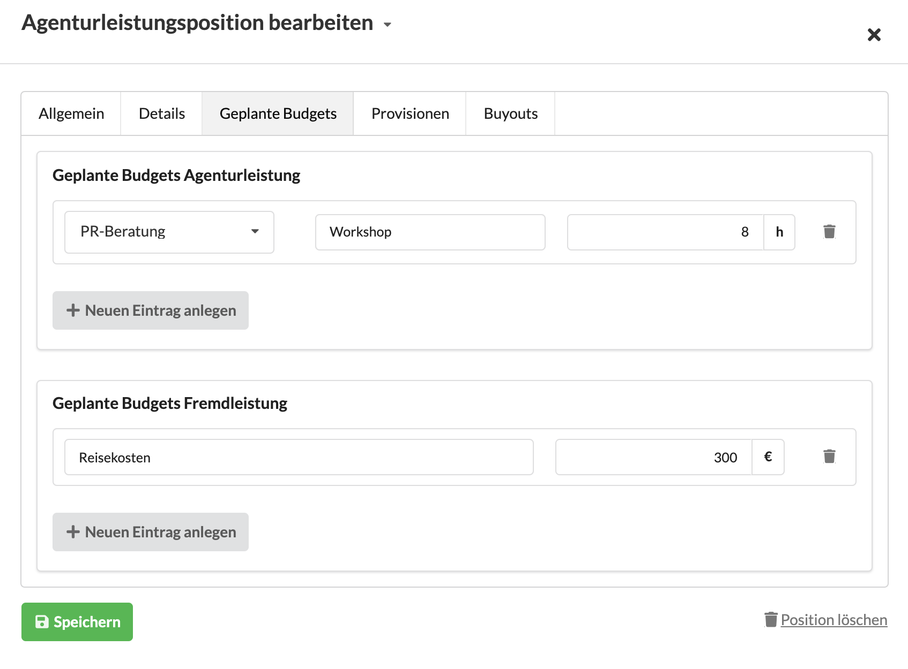
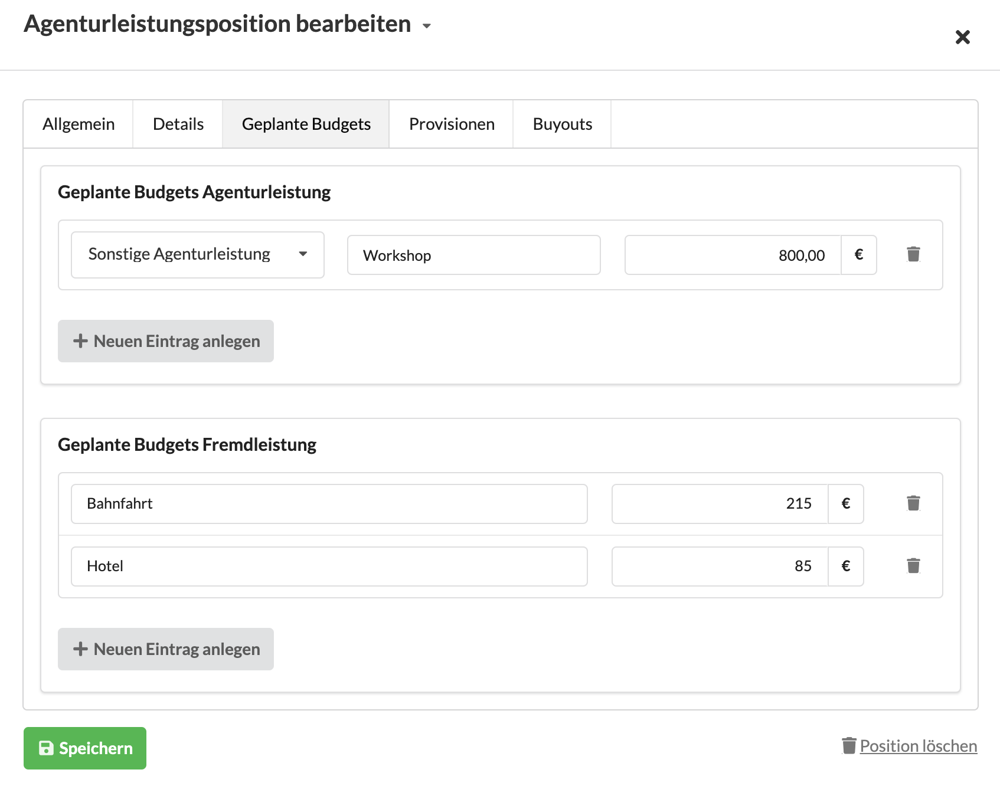

# Geplante Budgets an Kostenvoranschlagspositionen

In Positionen von Kostenvoranschlägen kann im Reiter Geplante Budgets hinterlegt werden, was für ein Budget ich - entgegen dem kalkulierten Wert einer Position - für die Umsetzung der Leistung einplane.

Beispielsweise habe ich für "Drucksachen" 500 EUR kalkuliert, von der Druckerei weiss ich jedoch dass sie uns nur 350 EUR in Rechnung stellen wird. Hier kann ich ein Geplantes Fremdleistungsbudget in Höhe von 350 EUR für diese Position hinterlegen.

Handelt es sich um eine gemischte Position - z.B. ein Beratungs-Workshop in Salzburg - kann ich als Geplantes Fremdleistungsbudget 300 EUR "Reisekosten" und als Geplantes Agenturleistungsbudget 8 h "Beratung" hinterlegen.

Es ist explizit auch möglich "Sonstige Agenturleistungen" anzugeben, z.B. weil ich noch nicht weiss, ob ein Junior oder Senior-Berater den Workshop durchführen wird.  
Ebenso können zu einer Position auch mehrere Agentur- oder Fremdleistungsbugets - wie im folgenden Beispiel für "Bahnfahrt" und "Hotel" - angegeben werden:

