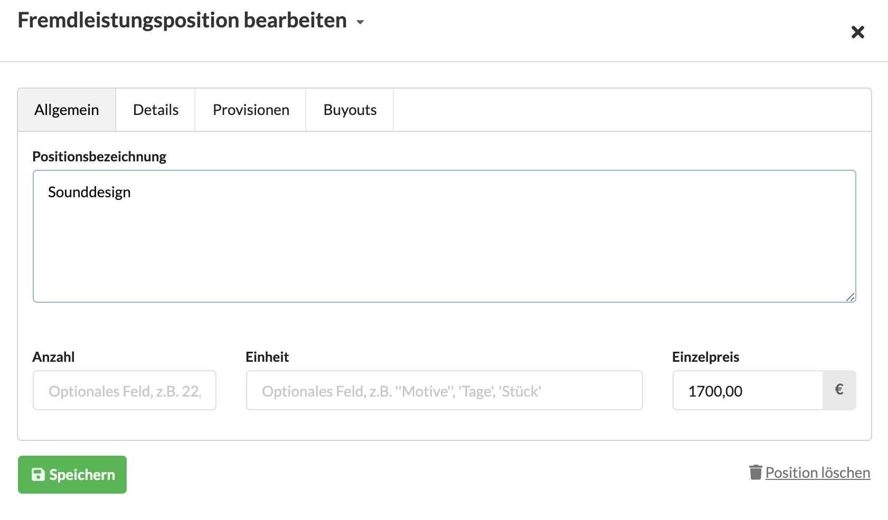
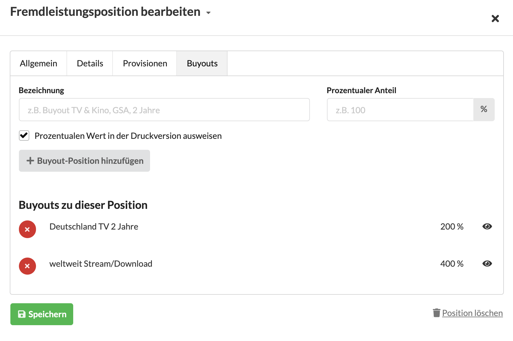
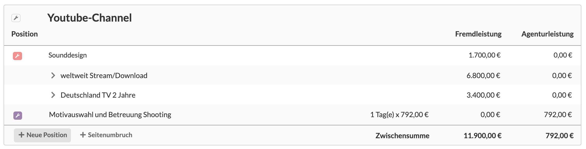
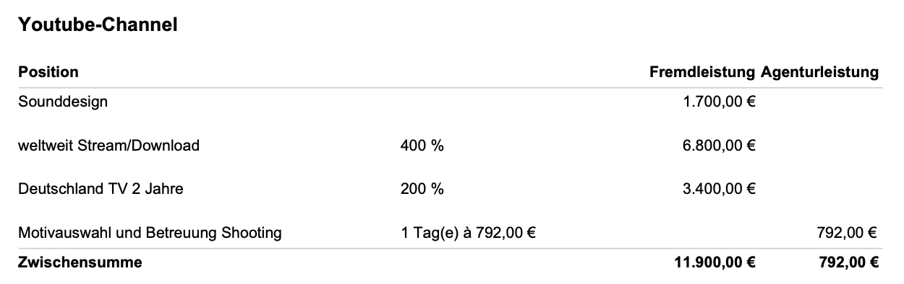

# Verwenden von Buyouts

Der Begriff Buyout kommt aus der Media Produktion und bezeichnet zusätzliche Kosten die bei Verwendung eines Werks z.B. eines Fotos oder Musikstücks anfallen.

Üblicherweise richtet sich ein Buyout nach Medien, Laufzeit und Territorien, evtl. auch nach dem Umstand ob das Werk exklusiv durch den Kunden genutzt werden darf, was sich in einem prozentualen Zuschlag zur eigentlichen Leistung \(z.B. Komposition, Schauspielerei, Fotografie\) niederschlägt.

In unserem Beispiel kalkulieren wir das Sounddesign einer externen Musikproduktion als Fremdleistung:

An dieser Position können nun mehrere Buyouts definiert werden.

In unserer Positionsliste sind die Buyouts nun ersichtlich.

In der Druckversion werden die Buyouts direkt an der Position ausgegeben.


Ändere ich nun den Preis der Originalposition \(hier: Sounddesign 1.700,- EUR\), so errechnen sich die Preise der Buyouts automatisch neu.


