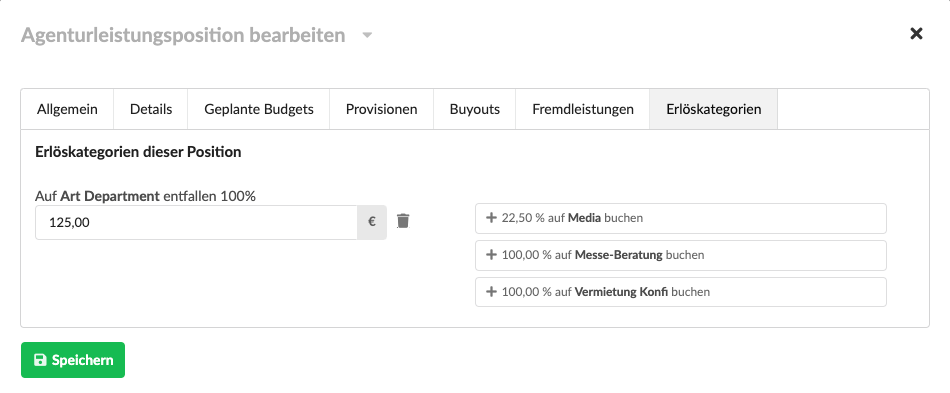

# Verwendung von Kosten- und Erlöskategorien

Kostenkategorien stehen in Gutschriften zur Verfügung, Erlöskategorien in Vorlagen, Kostenvoranschlägen sowie Ausgangsrechnungen.

Im Positionsdialog kann im Reiter "Erlöskategorien" \(bzw. "Kostenkategorien" bei Gutschriften\) eine Kategorie mit einem bestimmten Wert hinzugefügt werden.

Der Wert der dabei vorgeschlagen wird, ist die Netto-Summe der Position im Verhältnis des jeweils an der Kategorie konfigurierten Standard-Anteils.

Nach dem Hinzufügen, kann der Wert der Kategorie noch manuell angepasst werden, etwa um eine Position auf verschiedene Kategorien zu verteilen.

### Was passiert bei Kopieren und Abrechnen von Dokumenten oder beim Kopieren oder Importieren von Positionsgruppen oder Positionen?

Soweit möglich, werden zu Positionen hinzugefügte Kategorien auch beim Kopieren von Dokumenten, beim Kopieren oder Importieren von Positionsgruppen oder Positionen sowie beim Abrechnen von Kostenvoranschlägen mit kopiert.  
**Ausnahme**: Wenn eine mit Erlöskategorien versehene Ausgangsrechnung in eine Gutschrift \(oder umgekehrt\) kopiert wird, da in der Gutschrift nur Kostenkategorien \(keine Erlöskategorien\) zum Tragen kommen. 

### Stornieren von Rechnungen: Was passiert mit den Erlöskategorien?

Bei Erstellung einer Storno-Rechnung \(im Reiter Optionen der Ausgangsrechnung\) werden die Erlöskategorien in die Storno-Rechnung kopiert, jedoch mit negativem Wert.

Das Ergebnis ist, dass die Summe der Kategorien aus Ausgangsrechnung und Storno-Rechnung 0 ist.

### Wie werden Kosten- und Erlöskategorien konfiguriert?





