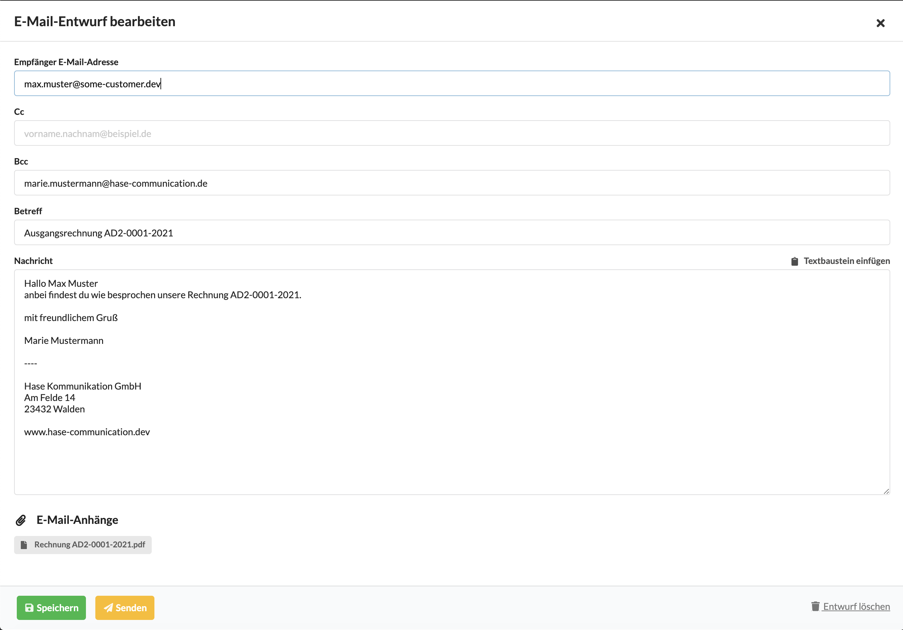

# Dokument versenden

## Versand eines Links

Über die Schaltfläche "Link zur Druckversion per Email senden" öffnet sich - sofern ein E-Mail-Programm auf deinem Computer installiert ist - eine E-Mail die einen Link zur Druckversion dieses Dokuments enthält. Diesen Link kannst du versenden. Der Empfänger benötigt keine Zugangsdaten um diesen Link zu öffnen. 

## Versand eines PDFs

Wir empfehlen den Versand der Druckversion als PDF-Dokument da ein Anhang höhere Verbindlichkeit für den Kunden hat und später ggf. auch Offline in seinem E-Mail-Programm auffindbar ist.

Nach dem Öffnen der Druckversion kann das PDF einfach über das Browsermenü \(Datei &gt; Speichern unter bzw. Ablage &gt; Speichern unter\) auf deinem Computer gespeichert werden und anschliessend auf einem beliebigen digitalen Kanal oder ausgedruckt per Post versendet werden.

## Versand von Dokumenten per E-Mail direkt aus dem System

### Technische Voraussetzungen für den Versand

Damit Dokumente wie z.B. KVs und Rechnungen über den Reiter "E-Mail-Versand" an Kunden versendet werden können muss zunächst sichergestellt sein, dass die richtigen DNS-Einstellungen bei eurem Provider für eure E-Mail-Domain hinterlegt wurden.

Mehr dazu findet Ihr unter Einstellungen &gt; Integrationen &gt; DNS-Einstellungen

Es muss ein CNAME sowie ein TXT-Record zu euren DNS-Einstellungen bei eurem Domain-Provider hinzugefügt werden.

### E-Mail erstellen

Um eine E-Mail zu einem Finanzdokument zu erstellen öffnen wir den Reiter E-Mail in diesem Finanzdokument und klicken auf "Neue E-Mail verfassen". Es öffnet sich ein Dialog, in dem eine E-Mail an den Kunden erstellt werden kann. Wurden Standard-Textbausteine für E-Mails und eine E-Mail-Signatur im Benutzerprofil hinterlegt, ist diese E-Mail beim Öffnen des Dialogs schon vollständig verfasst.

Die Empfänger E-Mail-Adresse ergibt sich - sofern gegeben - aus der am Kontakt hinterlegten E-Mail-Adresse oder E-Mails die zuvor auf diesen Projekt verfasst wurden.

Als Bcc-Empfänger \(Blindkopie\) wird automatisch der angemeldete Benutzer vorgeschlagen, als Betreff der Dokumententyp sowie die Dokumentennummer.

Der vorgeschlagene Nachrichtentext kann hier angepasst werden. 

Wurden Textbausteine wie Signaturen, oder verschiedene Anschreiben im System hinterlegt, können diese rechts oberhalb des Nachrichtentextfelds ausgewählt und hinzugefügt werden. Auch in E-Mails können Variablen verwendet werden.


HTML-Tags oder Bilder werden hier nicht unterstützt.


### Was passiert beim Versand?

Das Dokument kann über die gelbe "Senden"-Schaltfläche gespeichert und gleichzeitig abgesendet werden.

Das Dokument wird an den bzw. die Empfänger gesendet. Unser Finanzdokument - hier eine Ausgangsrechnung - wird als pdf an dieses Dokument angehängt.

Wird ein Dokument dann aus dem System versendet wird automatisch der Status geändert.

a\) bei Ausgangsrechnungen und Gutschriften auf "versandt"  
b\) bei Kostenvoranschlägen auf "wartet auf Freigabe"

Eine gesendete E-Mail zeigt in der Liste ihren Status:   
- Entwurf  
- versendet  
- erfolgreich zugestellt  
- Versand fehlgeschlagen  
- durch Empfänger geöffnet  
- als Spam markiert

Die letzten beiden Stati \(geöffnet,  sind abhängig davon ob der E-Mail-Server des Empfängers diese Informationen an uns zurückmeldet.

**Ein Dokument kann mehrmals versendet werden. Eine E-Mail kann auch zunächst nicht versendet sondern nur als Entwurf gespeichert werden.**

\*\*\*\*

