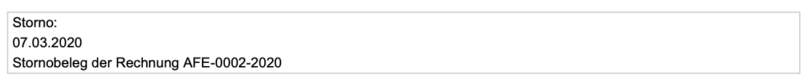

# Dokumente löschen und stornieren

## Dokument löschen

Im Reiter "Optionen" kann ein Finanzdokument gelöscht werden.

Bei Ausgangsrechnungen und Gutschriften hängt die Möglichkeit einer Löschung davon ab, ob die Inkrementelle Nummer des Rechnungsnummernkreises die höchste ihres Kreises ist.


**Beispiel**

AKA-2020-003 kann gelöscht werden  
AKA-2020-002 kann nur storniert werden  
AKA-2020-001 kann nur storniert werden  
AKA-2019-087 kann storniert oder gelöscht werden  
AKA-2019-086 kann nur storniert werden  
AKA-2019-085 kann nur storniert werden  
...


## Dokument stornieren

Beim Stornieren einer Ausgangsrechnung oder Gutschrift wird eine Kopie des Dokuments mit einer neuen Nummer erzeugt, deren Beträge mit -1 multipliziert werden. D.h. beide Dokumente zusammen verhalten sich buchhalterisch neutral.

In der Druckversion verweist ein Kasten im Fuß beider Dokumente auf das stornierte Dokumente bzw. das Quelldokument der Stornorechnung.

Der Zahlungsstatus dieser beiden Dokumente wird auf "storniert" gestellt.

