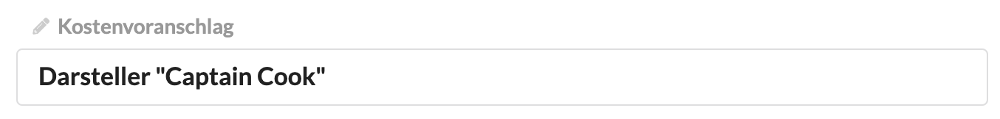

# Dokumententitel

Ein Finanzdokument führt zwei Titel. Zum einen den Dokumententyp \(z.B. "Ausgangsrechnung", "Kostenvoranschlag", "Storno-Rechnung",...\), zum anderen den von euch vergebenen Betreff, z.b. "Website Relaunch".

## Änderung der Bezeichnung des Dokumententyps

Um den Dokumententyp z.B. von "Kostenvoranschlag" in "Nachkalkulation" zu ändern, können wir einfach neben dem Bleistift auf die Bezeichnung klicken und das Feld anders beschriften.


**Hinweis**: Im Gegensatz zu den vorgeschlagenen Bezeichnungen \(z.B: "Ausgangsrechnung"\) werden manuell geänderte Bezeichnungen nicht automatisch in andere Sprachen \("Invoice"\) übersetzt, wenn die Sprache in den Druckversionseinstellungen geändert wird.


## Änderung des Betreffs

Der Betreff bezeichnet euer Dokument einerseits für euch intern, damit ihr es in der Suche leicht auffinden könnt, zum anderen ist er die Überschrift über eurem Finanzdokument, d.h. auch für euren Kunden prominent sichtbar.

## Anzeige von Dokumententyp und Betreff in der Druckversion

Standardmässig werden Dokumententyp und Betreff zweizeilig in der Druckversion dargestellt:

> Ausgangrechnung  
> Reisekosten Workshop Berlin

Es ist auch möglich die Darstellung einzeilig zu konfigurieren:

> Ausgangrechnung \| Reisekosten Workshop Berlin

Diese Änderung lässt sich nicht über die Weboberfläche vornehmen. Sprecht den Kundenservice an:  
info@diagenturverwaltung.de

