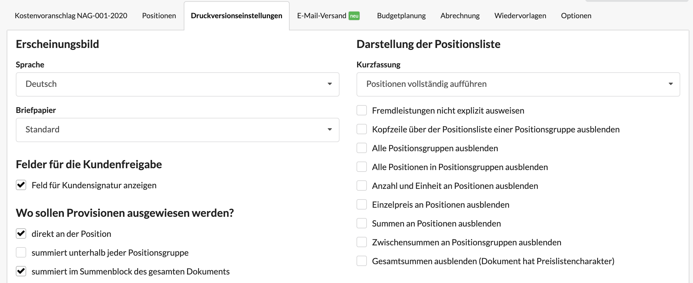
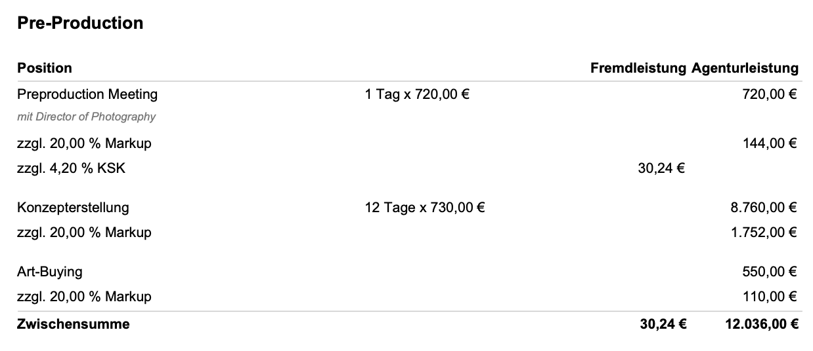
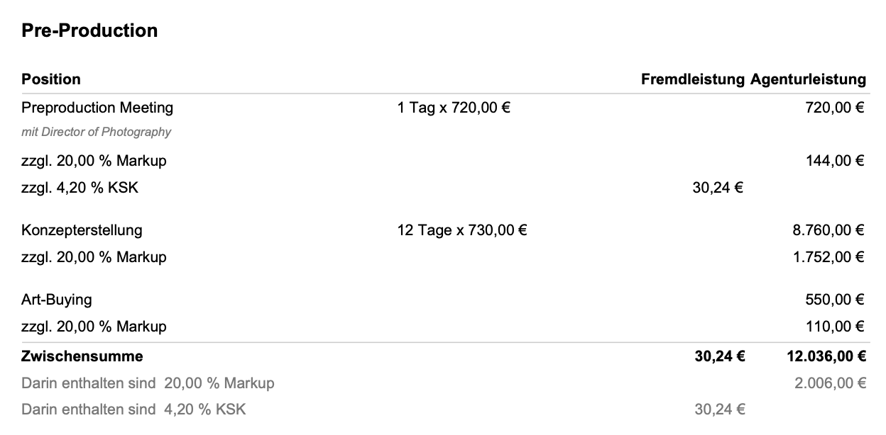
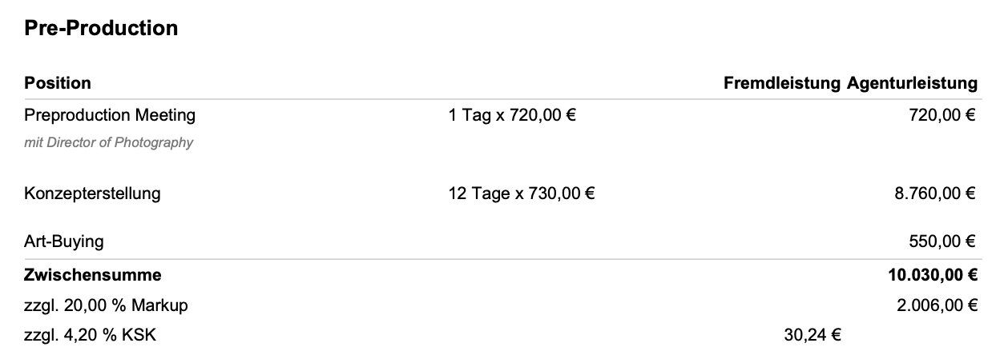
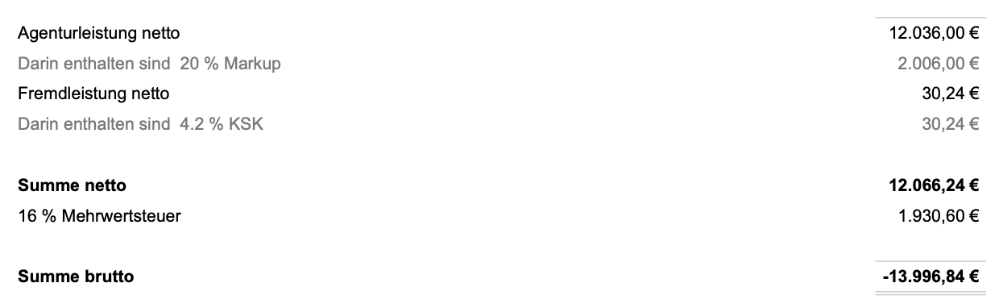
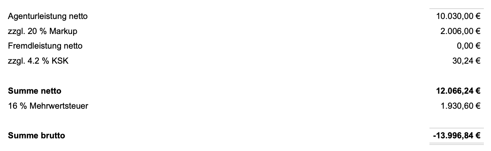
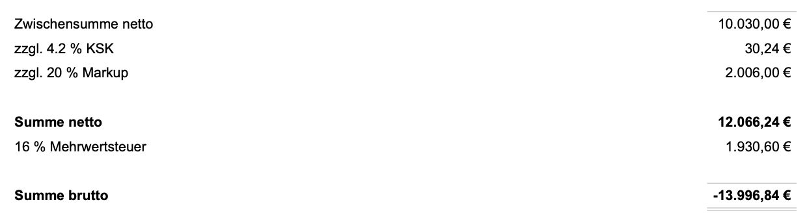
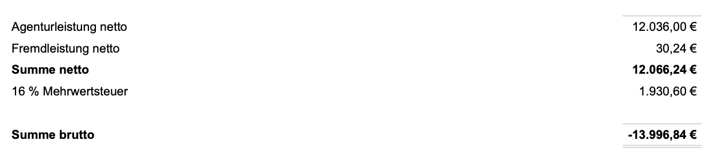
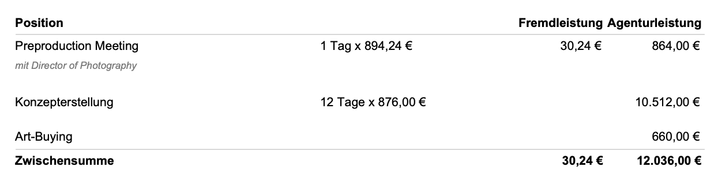
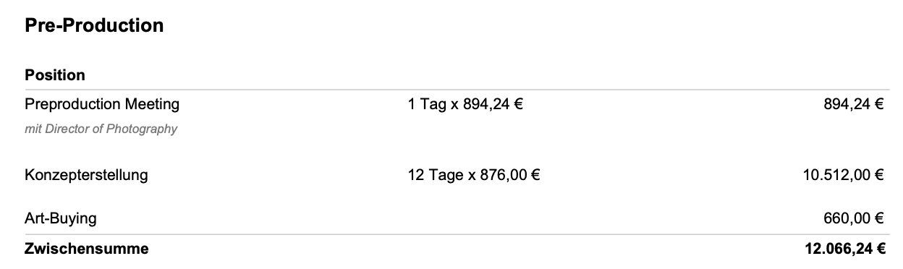

# Druckversionseinstellungen

### 

### Sprache

Die Agenturverwaltung unterstützt zur Zeit zwei Sprachen bei der Verwendung von Finanzdokumenten.  
Die Auswahl der Sprache - z.B. englisch - führt dazu dass alle nicht editierbaren Texte eines Dokuments auf englisch ausgegeben werden, also z.B. die Überschrift "Estimate of Cost", Zwischensummen "Subtotal" usw.

> Diese Funktion führt nicht zu einer maschinellen Übersetzung der vom Nutzer eingegebenen Daten.

Solltet ihr Bedarf an weiteren Sprachen haben, sprecht unseren Kundenservice an: info@dieagenturverwaltung.de

Die Standardsprache für Finandokumente ist deutsch, sie kann jedoch am Etat unter "Einstellungen" angepasst werden, z.B. wenn einer eurer Kunden seine Dokumente auf englisch erhalten möchte.

### Briefpapier

Die Auswahl des Briefpapiers auf das die Druckversion zurück greift, kann am Finanzdokument eingestellt werden. Es ist möglich einen Standardwert im Etat eines Kunden unter "Einstellungen" zu definieren.


**Anwendungsbeispiele**   
Ihr nutzt für alle Kunden ein bestimmtes Girokonto, ein bestimmter Kunde soll jedoch seinen Zahlungen an ein extra für ihn eingerichtetes Bankkonto leisten. Damit die richtige Bankverbindung in Rechnungen an diesen Kunden im Briefpapier angezeigt wird, kann für diesen Kunden ein eigenes Briefapier angelegt und im Etat als Standard definiert werden.  
  
Ihr führt verschiedene Untermarken eures Unternehmens z.B. "Hase Kommunikation" und "Hase Media Production", je nach Auftrag könnt ihr hier das korrekte Briefpapier mit dem entsprechenden Unternehmenslogo nutzen.  
  
Ihr legt 10 verschiedene Briefpapiere an, die alle einen unterschiedlichen kleinen Banner mit einer Werbebotschaft verfügen und rotiert diese nach dem Zufallsprinzip.


Wie man das Briefpapier anpasst und weitere Briefpapiere erstellt, erfährst du hier:



### Kurfassung der Positionsliste

Diese Funktion ermöglicht es eine verkürzte Version der Positionsliste in der Druckversion anzuzeigen.

#### Nur Positionsgruppen aufführen, keine Einzelpositionen

In dieser Darstellungsart werden nur die Überschriften und Zwischensummen der Positiongruppen angezeigt. Die einzelnen Positionen mit ihren Details werden ausgeblendet. Dadurch wird das Dokument stark gekürzt, Details wie z.B. die Anzahl von Stunden einer bestimmten Funktion oder Einzelpreise bestimmter Fremdleistungen werden dadurch nicht transparent angezeigt.

So wird eine Positiongruppe mit mehrere Positionen ...

> **Workshop Berlin 20.05**
>
> * 4 h Beratung zu 100,- EUR
> * Fahrtkosten 119,- EUR
> * Hotel 129,- EUR

... gekürzt auf  ...

> Workshop Berlin 20.05 348,- EUR

#### Nur Positionsgruppen anzeigen, Einzelpositionen kommasepariert als Textblock zusammenfassen

In dieser Darstellungsart werden nur die Überschriften und Zwischensummen der Positiongruppen angezeigt. Die Positionsbezeichnungen der einzelnen Positionen wird hier jedoch noch als Fliesstext angezeigt, jedoch ohne Beträge.

So wird eine Positiongruppe mit mehrere Positionen ...

> **Workshop Berlin 20.05**
>
> * Beratung 4 h zu 100,- EUR
> * Fahrtkosten 119,- EUR
> * Hotel 129,- EUR

... gekürzt auf  ...

> Workshop Berlin 20.05 348,- EUR  
> _Beratung, Fahrtkosten, Hotel_

### Fremdleistungen einfach als "Leistungen" anzeigen

In manchen Fällen werden dem Kunden eingekaufte Leistungen als Agenturleistung verkauft. Um für die interne Auswertung trotzdem festhalten zu können welcher Teil des Budgets für externe Lieferanten reserviert bleiben soll, kann man mit dieser Funktion auf die getrennte Anzeige von Agentur- und Fremdleistungen verzichten. Es wird dann kein Leistungstyp angezeigt. Die Betragsspalten für Agentur- und Fremdleistung in der Positionsliste fallen auf eine Spalte zusammen.

Diese Funktion macht nur Sinn, wenn das Dokument sowohl Agentur- als auch Fremdleistungen enthält da es sonst ohnehin nur einspaltig dargestellt wird.

### Weitere Anzeigeoptionen

#### Kopfzeile über der Positionsliste einer Positionsgruppe ausblenden 

Hiermit lässt sich die Kopfzeile \(Position, Agenturleistung/Fremdleistung bzw. Summe\) aller Positionsgruppen ausblenden.

#### Alle Positionsgruppen ausblenden 

MIt dieser Funktion können alle Gruppen ausgeblendet werden. Das Dokument zeigt dann in der Positionslsite nur noch Kopf- und Fussbemerkung sowie die Summen.

#### Alle Positionen in Positionsgruppen ausblenden 

MIt dieser Anzeige werden die Positionen einer Positionsgruppe ausgeblendet. Es wird nur der TItel der Positionsgruppe mit Beschreibung sowie die Kopf- und der Fusszeile mit Zwischensumme angezeigt.

#### Summen an Positionen ausblenden 

Hiermit lassen sich die Beträge der einzelnen Positionen einer Positionsgruppe ausblenden. Preise gehen dann nur aus der Zwischensumme der Positionsgruppe hervor.

#### Zwischensummen an Positionsgruppen ausblenden 

Um Zwischensummen an Positionsgruppen auszublenden kann dieses Häkchen gesetzt werden. 

#### Gesamtsummen ausblenden um das Dokument als Preisliste auszugeben

Hat ein Dokument eher den Charakter einer Preisauskunft oder Preisliste, z.B. weil viele optionale Positionsgruppen in einem Kostenvoranschlag aufgeführt werden und noch unklar ist wofür sich der Kunde entscheiden wird, können hiermit die Gesamtsummen am Doument ausgeblendet werden.  
Der Kunde wird dann nicht von einer Summe abgelenkt, die Teile des Angebots enthält die der Kunde gar nicht zu bestellen beabsichtigt.


**Anwendungsbeispiel**

Wir erstellen für einen Kunden ein Angebot mit drei Positionsgruppen:  
_Facebook-Channel-Moderation 3.000,- EUR  
Starter-Paket: Content-Erstellung 10 Artikel 6.000,- EUR  
FullService-Paket: Content-Erstellung 20 Artikel 12.000,- EUR_  
  
Wir wollen dem Kunden hier die Wahl zwischen dem Starter und dem FullService-Paket lassen.   
Das Angebot ist also eine Preisauskunft.  
Der Kunde soll hier aber nicht die Summe aller Optionen \(21.000 EUR\) angezeigt bekommen, weil die angebotenen Positionen sich nicht eigenen zusammen bestellt zu werden.


## Darstellungsmöglichkeiten von Provisionen

Provisionen, können auf verschiedene Arten in der Druckversion angezeigt werden.

### Darstellungen an der Position

In diesem Beispiel werden Provisionen an jeder Position ausgewiesen, jedoch nicht an der Positionsgruppe. Die Zwischensumme der Positionsgruppen enthält daher auch die Summe der Provisionen:

Da Provisionen in diesem Beispiel nicht an der Positionsgruppe aufgeführt werden sollen, enthält die Positionsgruppe lediglich die Summe aus Positionswerten und Provisionen und schlüsselt letztere nicht weiter auf.

### Darstellung An der Positionsgruppe

Im folgenden Beispiel werden Provisionen sowohl an der Position als auch an der Positionsgruppe ausgewiesen. Die Gruppe führt die Provisionen daher nur noch einmal der Übersicht halber als enthalten auf, da die Positionen diese ja bereits aufführen.

Wird dagegen nur an der Positionsgruppe eine Provision angezeigt, nicht an der Position selbst, zeigt die Zwischensumme der Positionsgruppe an, dass die Provisionen sich zuzüglich verstehen:

### Darstellung im Summenblock unterhalb der Positionsliste

Im Summenblock können Provisionen auf verschiedene Arten erscheinen:

a\) Wenn Provisionen in Positionen und/oder Gruppen angezeigt werden, so zeigt der Summenblock diese als _enthalten_ an:

b\) In diese Beispiel wurden Provisionen _nur_ im Summenblock angezeigt, daher verstehen sie sich hier zuzüglich der Agentur- und Fremdleistung.

Hier die gleiche Darstellung wenn "Fremdleistungen nicht explizit ausweisen" aktiviert ist:

c\) Sind Provisionen in einem Dokument enthalten, sollen aber nicht im Summenblock angezeigt werden, so ergeben sie sich aus den Summen der Positionen oder Positionsgruppen:

### Provisionen nicht darstellen, sondern in die Einzelpreise der Positionen einrechnen

Hier werden Provisionen weder an der Position, noch an der Positionsgruppe noch im Summenblock unterhalb der Positionsliste ausgewiesen.

Sie werden dann automatisch in die Einzelpreise eingerechnet. 

Da in diesem Beispiel Provisionen für sowohl Agentur- als auch Fremdleistungen verwendet wurden, lässt sich deren Anteil noch an der zweispaltigen Ausgabe von Agentur- und Fremldeistung erahnen. 

Dies lässt sich verhindern indem die Darstellungsoption "Fremdleistungen nicht explizit ausweisen" aktiviert wird:

