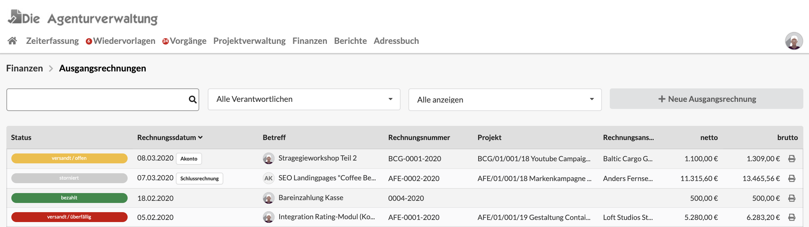
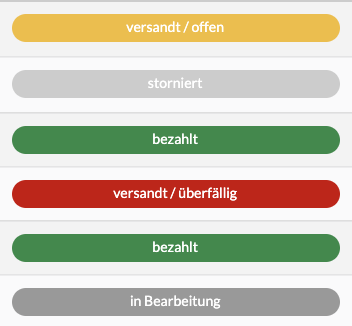

# Ausgangsrechnungen

## Filter in der Ausgangsrechnungsliste

Die Liste der Ausgangrechnungen lässt sich über Filter oberhalb der Liste einschränken.

### Suche mit Wildcards \*

Die Suche erlaubt das Suchen nach Dokumentennummer, Projektnummer,Lieferant oder Betreff des Dokuments.  
Mit dem Asterisk \(\*\) können auch Wildcard-Suchen durchgeführt werden im abgebildeten Beispiel kann ich z.B. durch die Eingab des Suchbegriffs `12*2020`  Alle Dokumente finden in denen "12" gefolgt von "2020" vorkommt. Wir hätten hier z.B. einen Suchtreffer beim zweiten Dokument der Liste.

### Suche nach Verantwortlichem

Über diesen Filter kann ein Nutzer ausgewählt werden und die Liste zeigt dann nur die Dokumente dieses Nutzers. Der Filter beinhaltet auch den Eintrag "Meine Ausgangsrechnungen".

### **Suche nach Status**

Dieser Filter schränkt die Liste nach Dokumenten ein, die sich in einen bestimmten Status befinden.


FIltereinstellungen werden bis zur nächsten Anmeldung am System gespeichert.


## Status von Ausgangsrechnungen

Ausgangsrechnungen laufen durch folgende Prozessschritte:

#### in Bearbeitung

Dieses Dokument wird zur Zeit erstellt oder gerade geändert, es wird in keiner Auswertung mitberücksichtigt. Dokumente in diesem Status tauchen in keiner Statistik auf.

#### wartet auf Versand

Dieses Dokument ist fertiggestellt, wartet jedoch noch auf Prüfung durch einen anderen Nutzer bevor es versendet werden kann. Dokumente in diesem Status tauchen in keiner Statistik auf.

#### versandt

Dieses Dokument wurde bereits an den Kunden gsendet. In Statistiken wird der Umsatz des Dokuments nun mitberücksichtigt.

#### reklamiert

Der Kunde hat dieses Dokument aus formalen oder inhaltlichen Gründen nicht akzeptiert. In Statistiken taucht es nicht als Umsatz auf.

#### gebucht

Dieses Dokument wurde bereits in die Buchhaltung übergeben.


**Hinweis:** In deinem Unternehmen sind eventuell nicht alle Prozessschritte aktiviert. Sprich den Kundenservice an, wenn du daran etwas ändern möchtest: info@dieagenturverwaltung.de


In der Liste der Ausgangsrechnungen kann auf einen Blick erkannt werden, in welchem Status sich ein Dokument befindet:

