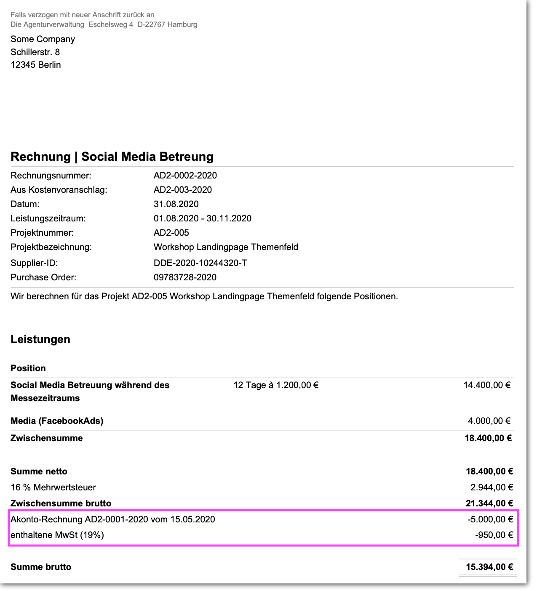

# Die Positionsliste

Wie man Positionen anlegt, bearbeitet, dupliziert, löscht und importiert erfährst du hier:



## Umsatzsteuersatz

In Ausgangsrechnungen lässt sich darüber hinaus unterhalb der Positionsliste die Umsatzsteuer definieren. Hier wird erklärt wie das geht:



## Welchen Umsatzsteuersatz nutzen?


**Als Faustregel für Agenturen gilt: 19%**   
\(bzw. 16% zwischen dem 01.07.2020 und dem 31.12.2020\)

Selbst wenn ihr Waren und Dienstleistungen von einem Lieferanten, z.B. einem Caterer oder Hotel für 7% einkauft, werden diese für 19% zusammen mit anderen Leistungen an euren Kunden verkauft.


## Temporäre MwSt-Umstellung 2020 in Deutschland 

Die Bundesregierung hat am 04.06.2020 einen Gesetzesentwurf auf den Weg gebracht, der vorsieht, die Umsatzsteuersätze für den Zeitraum 01.07.2020 bis 31.12.2020 von derzeit 7 bzw. 19% auf 5 und 16% zu senken.

**Was bedeutet das für die Abrechnung einer Agentur?**

#### Wirtschaftliche Bedeutung

Die Änderung macht sich i.der Regel nicht wirtschaftlich bemerkbar, da Agenturen zum Vorsteuerabzug berechtigt sind. Da Agenturen ihre Angebote i. d. Regel netto kalkulieren, ist auch nicht damit zu rechnen dass - wie das etwa im Einzelhandel vermutet wird - hier eventuelle Gewinne aus Differenzen von 16 und 19% entstehen werden.

#### Wann wird welcher MwSt-Satz angewendet?

Generell gilt: Das Datum der **Leistungserbringung** ist ausschlaggebend für den Umsatzsteuersatz. Bei Agenturen ist die Leistungserbringung meist erst am Ende des Zeitraums in dem an einem Projekt gearbeitet gegeben. D.h. mit Abgabe eines Ergebnisses - z.B: Bannern, einer Webseite oder einem Workshop.Wenn es sich irgendwie vermeiden lässt, sollten Rechnungen, deren Leistungszeitraum über den 01.07.2020 oder den 31.12.2020 hinaus gehen, in zwei Dokumente aufgeteilt werden: **Ein Dokument mit Leistungen vor der Umsatzsteuersatz-Umstellung und ein Dokument mit den Leistungen nach der Umstellung**.

#### Achtung bei Stornorechnungen \(Rechnungskorrektur\)

Wird eine Rechnung storniert, sollte darauf geachtet werden, dass Datum und Leistungszeitraum der Rechnungskorrektur dem Datum der zu stornierenden Rechnung entsprechen, damit es nicht zu Steuerzahlungen für die Differenz kommt.

#### Achtung bei Teil- und Akonto-Rechnungen

Akonto-Rechnungen werden i.d. Regel gestellt wenn ein Projekt über einen längeren Zeitraum läuft. Hier gilt zu beachten dass eine Akonto-Rechnung mit 19%  unter Umständen bei der späteren Schlussrechnungslegung \(mit 16%\) zu Verwirrung führen kann. Wir empfehlen hier die abschliessende Abrechnung von Projektteilen zum jeweiligen Wechsel-Datum der gesetzlichen Mehrwersteuer.

### Was tun wenn die Akonto-Rechnung bereits mit 19% gestellt wurde, die Schlussrechnung wegen des Leistungszeitraums jedoch nur 16% MwSt beinhaltet?

In diesem Beispiel wurde im Mai eine Akonto-Rechnung mit 19% gestellt, die Schlussrechnung im August jedoch mit 16%. In der Schlussrechnung bringen wir hier die Akonto-Rechnung zum Abzug. Das geht mit einem Brutto-Abzug wie in diesem Beispiel:

Die Agenturverwaltung erlaubt über die Funktion "**Brutto-Abzüge**" auch solche Fälle bei Schlussrechnungen zu handhaben: Die Akontorechnung eines langlaufenden Projekts wurde mit 19% im Mai 2020 gestellt, das Projekt wird später mit 16% im August abgerechnet, jedoch soll die Akontorechnung entsprechend berücksichtigt werden. Ihr solltet den Anbieter eurer Software in solchen Fällen also ggf. kontaktieren und euch mit eurem Steuerberater dazu abstimmen.

Mehr zu Abzügen findet sich hier:



### Was tun wenn Rechnungsdatum und Leistungszeitraum nicht zusammenfallen?

Die MwSt im System wird anhand des gewählten Rechnungsdatums vorgeschlagen, relevant ist jedoch der Leistungszeitraum. Solltet Ihr eine auf Juni datierte Rechnung für eine Leistung im Juli erstellen wollen, könnt ihr das Datum der Rechnung zunächst auf Juli stellen, dann die MwSt von 16% auswählen und anschliessend das Datum wieder zurückdatieren. Ihr erhaltet dann zwar eine Warnung, könnt das Dokument so jedoch trotzdem speichern.

