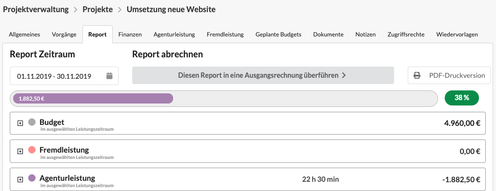
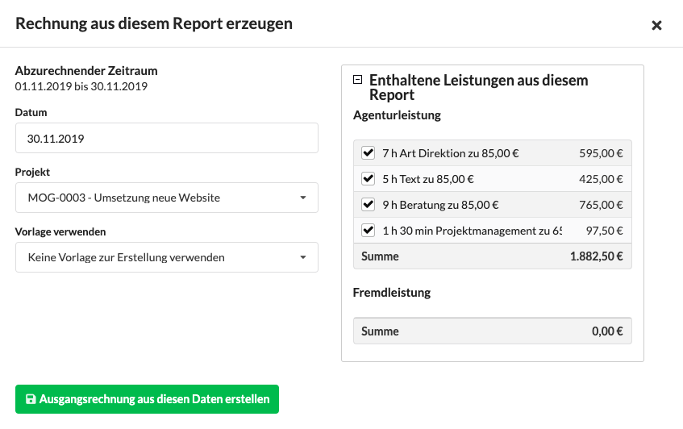

# Erstellung einer Ausgangsrechnung nach Aufwand aus dem Projekt-Report

Wir möchten euch organisatorische Aufgaben wie das Erstellen von Rechnungen so einfach wie möglich machen, sodass euch mehr Zeit für anderen Tätigkeiten im Agenturalltag bleiben.

Sollte im Rahmen eines Projekts die Abrechnung nach Aufwand, wie es häufig im Kontext [agiler Projekte](https://www.dieagenturverwaltung.de/blog/agil-arbeiten-mit-agentursoftware/) der Fall, vereinbart worden sein, ist die regelmäßige monatliche Abrechnung eines Projekts mit wenigen Klicks möglich.

Um ein Projekt am Ende eines Monats oder zu Beginn des Folgemonats abzurechnen, navigiert in dem abzurechnenden Projekt im Reiter "Report", wählt den abzurechnenden Zeitraum aus und klickt auf den Button "Diesen Report in eine Ausgangsrechnung überführen".  

Es öffnet sich eine Übersicht der abzurechnenden Aufwände, in welcher Leistungen nach Bedarf herausgefiltert werden können - z.B. um sie  auf mehrere Ausgangsrechnungen zu verteilen. 

An dieser Stelle kann auch eine Vorlage verwendet werden, Positionen aus der Vorlage werden dann zuvor auch hier aufgeführt und können ggf. vor der Erzeugung der Rechnung deaktiviert werden.

Mit einem Klick auf "Ausgangsrechnung aus diesen Daten erstellen" wird eine Ausgangsrechnung erzeugt. 


_**Übrigens**: Auch im Leistungszeitraum angefallene Fremdleistungen, z.B. Reisekosten, gemietete IT-Infrastruktur oder Hardware kann nach diesem Prinzip mit abgerechnet werden._


Zur besseren Transparenz kann der Rechnung auch ein in der Agenturverwaltung erzeugter Stundenreport beigelegt werden, der alle auf dem Projekt im Leistungszeitraum angefallenen Leistungen detailliert dokumentiert.

## Automatische Abrechnung eines Honoraretats

Wird auf ein Report eines Honoraretats auf Etatebene abgerechnet, besteht an dieser Stelle zusätzlich die Möglichkeit das Vertragshonorar \(Agentur- und Fremdleistung\) statt angefallener Agentur- und Fremdleistung abzurechnen.

> **Anwendungsszenario**  
> Wir haben einen laufenden Jahreshonorarvertrag mit unserem Kunden bei dem wir monatlich eine Pauschale für Agenturleistung - z.B. 1200,00 EUR - sowie Fremdleistungen \(wie Kuriere, Lektorat, Media\) nach Aufwand - also das was im Abrechnungszeitraum angefallen ist - abrechnen.  
> In diesem Fall würden wir aus dem Honoraretat die Agenturleistung auswählen und die angefallene Fremdleistung aus dem Report.

