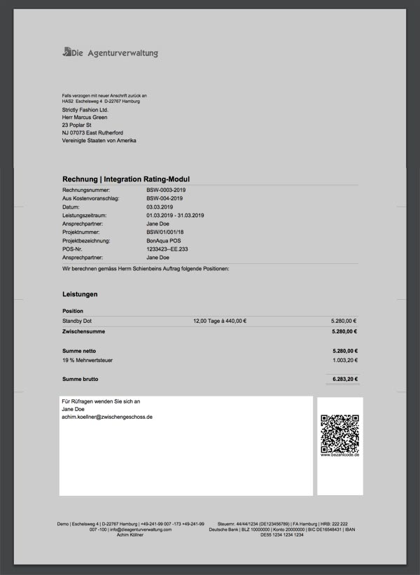

# Maschinenlesbarkeit

Der QR-Code erscheint nur auf der Druckversion unbezahlter Ausgangsrechnungen wenn ihr bei der initialen Einrichtung der Agenturverwaltung durch den Kundenservice eure Bankverbindung hinterlegt habt.


**Möchtet ihr diese Funktion nutzen?**  
Sendet eure Bankverbindung mit IBAN und BIC an den [Kundenservice](mailto:info@dieagenturverwaltung.de).


