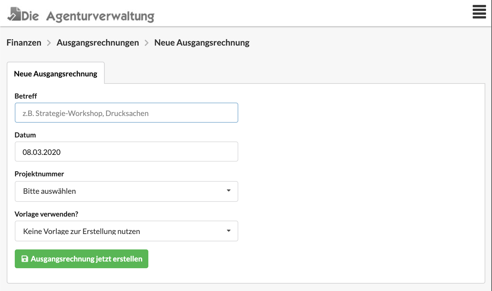

# Neue Ausgangsrechnung erstellen

Bei der Erstellung einer Ausgangsrechnung geben wir einen Betreff, ein Datum und eine Projektnummer an.

Eine neuee Ausgangsrechnung kannt auf verschiedene Arten erstellt werden:

### Aus der Liste der Ausgangsrechnungen

Im Menü unter Finanzen &gt; Ausgangsrechnungen gelangst du zur Liste der Ausgangsrechnungen. Rechts oberhalb der Liste befindet sich eine Schaltfläche "Neue Ausgangsrechnung".

### Aus einem Projekt

Im Reiter "Finanzen" eines Projekts findest Du alle bisher erstellen Ausgangsrechnungen dieses Projekts. Oberhalb der Liste kann die Schaltfläche "Neue Ausgangsrechnung" genutzt werden.

### Aus einem Etat

Im Reiter "Finanzen" eines Etats findest Du alle bisher erstellen Ausgangsrechnungen dieses Etats. Oberhalb der Liste kann die Schaltfläche "Neue Ausgangsrechnung" genutzt werden.

### Aus einem Kunden

Im Reiter "Finanzen" eines Kunden findest Du alle bisher erstellen Ausgangsrechnungen dieses Kunden. Oberhalb der Liste kann die Schaltfläche "Neue Ausgangsrechnung" genutzt werden.

### Aus einer Gutschrift

Du kannst die Gutschrift unter "Finanzen &gt; Vorlagen" öffnen, zum Reiter "Optionen" springen und dort eine Kopie der Gutchrift mit dem Zielformat "Ausgangsrechnung" erzeugen.

### Aus einer Vorlage

Du kannst entweder ...

* ... beim Anlegen einer Ausgangsrechnung eine Vorlage auswählen, oder
* ... die Vorlage unter "Finanzen &gt; Vorlagen" öffnen, zum Reiter "Optionen" springen und dort eine Kopie der Vorlagen mit dem Zielformat "Ausgangsrechnung" erzeugen.


**Hinweis**  
Wenn Du eine **Ausgangsrechnung aus einem** **Kostenvoranschlag** erzeugen möchtest, nutze die Abrechnungsoptionen im Reiter "Abrechnung" des Kostenvoranschlags.


